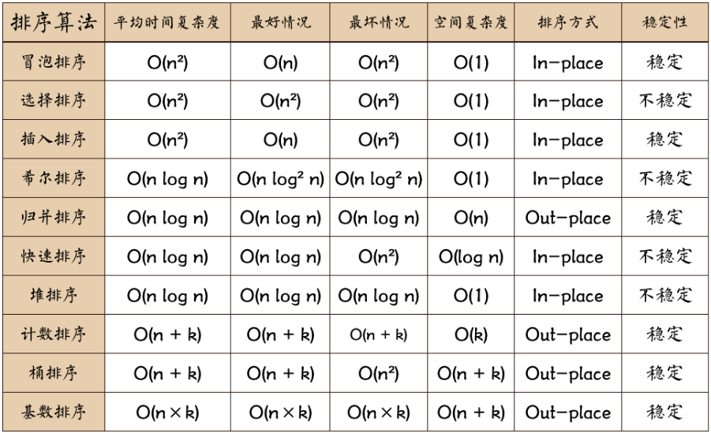
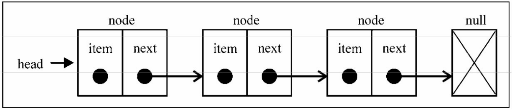
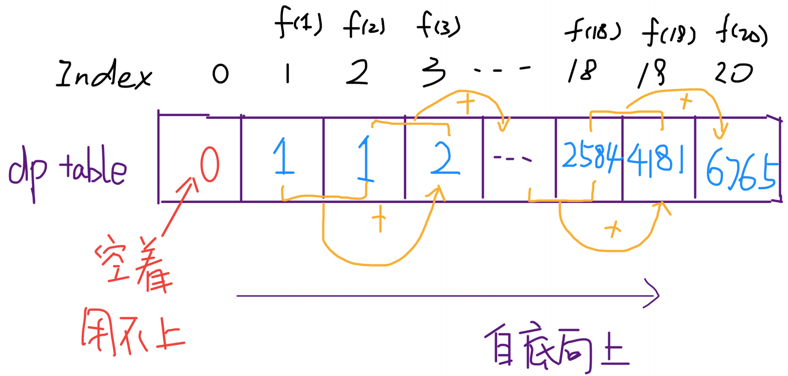

## 前端算法和数据结构

### 复杂度

O的概念，来描述算法的复杂度，简而言之，就是算法执行所需要的执行次数，和数据量的关系( 时间复杂度)， 占用额外空间和数据量的关系(空间复杂度)

`O(1)` : 常数复杂度 (和数据量无关) 

`O(log n)` :对数复杂度 (每次⼆分) 

`O(n)` : 线性时间复杂度 （数组遍历⼀次） 

`O(n*log n)` : 线性对数 （遍历+⼆分） 

`O(n^2)` : 平方 两层遍历 

`O(n^3)` : 立方

`O(2^n)` : 指数 

`O(n!)` : 阶乘



##### 名词解释：

n: 数据规模
k:“桶”的个数
In-place: 占用常数内存，不占用额外内存
Out-place: 占用额外内存
稳定性：排序后2个相等键值的顺序和排序之前它们的顺序相同

（1）对于评述算法优劣术语的说明

稳定：如果a原本在b前面，而a=b，排序之后a仍然在b的前面；
不稳定：如果a原本在b的前面，而a=b，排序之后a可能会出现在b的后面；

内排序：所有排序操作都在内存中完成；
外排序：由于数据太大，因此把数据放在磁盘中，而排序通过磁盘和内存的数据传输才能进行；

时间复杂度: 一个算法执行所耗费的时间。
空间复杂度: 运行完一个程序所需内存的大小。

### 稳定性

数组中[ {name:'xx', age:12}, {name:'yy', age:12}] 如果按照age排序，排序后，xx和yy的相对位置不变，我们成为稳定的算法，否则不稳定

### 排序

搜索和排序，是计算机的几个基本问题

### **冒泡排序（Bubble Sort）**

最经典和简单粗暴的排序算法，简而言之，就是挨个对比，如果比右边的数字⼤，就交换位置 遍历⼀次，最⼤的在最右边，重复步骤，完成排序


```js
function bubleSort(arr) {
    var len = arr.length
    for (let outer = len; outer >= 2; outer--) {
        for (let inner = 0; inner <= outer - 1; inner++) {
            if (arr[inner] > arr[inner + 1]) {
                [arr[inner], arr[inner + 1]] = [arr[inner + 1], arr[inner]]
            }
        }
    }
    return arr
}
console.log(bubleSort([4, 3, 6, 1, 9, 6, 2]))
```

##### 什么时候最快（Best Cases）：

当输入的数据已经是正序时

##### 什么时候最慢（Worst Cases）：

当输入的数据是反序时

n^2 空间 1 稳定

### 选择排序（Selection Sort）

在时间复杂度上表现最稳定的排序算法之一，因为无论什么数据进去都是O(n²)的时间复杂度。。。所以用到它的时候，数据规模越小越好。唯一的好处可能就是不占用额外的内存空间了吧。


首先在未排序序列中找到最小（大）元素，存放到排序序列的起始位置，然后，再从剩余未排序元素中继续寻找最小（大）元素，然后放到已排序序列的末尾。

```js
function selectionSort(arr) {
  let minIndex, temp;
  for (let i = 0; i < arr.length - 1; i++) {
    minIndex = i;
    for (let j = i + 1; j < arr.length; j++) {
      if (arr[i] < arr[j]) {
        minIndex = i;
      }
    }
    temp = arr[i];
    arr[i] = arr[minIndex];
    arr[minIndex] = temp;
  }
  return arr;
}
console.log("选择排序:", selectionSort(arr));
```

### **插入排序（Insertion Sort）**

插⼊排序逻辑和冒泡类似，只不过没采用挨个交换的逻辑，而是在⼀个已经排好序的数组里，插⼊⼀个元素，让它依然是有序的

插入排序的代码实现虽然没有冒泡排序和选择排序那么简单粗暴，但它的原理应该是最容易理解的了，因为只要打过扑克牌的人都应该能够秒懂。


```js
function insertSort(arr) {
    for (let i = 1; i < arr.length; i++) { //外循环从1开始，默认arr[0]是有序段
        for (let j = i; j > 0; j--) { //j = i,将arr[j]依次插⼊有序段中
            if (arr[j] < arr[j - 1]) {
                [arr[j], arr[j - 1]] = [arr[j - 1], arr[j]];
            } else {
                break;
            }
        }
    }
    return arr;
}
console.log(insertSort([11, 4, 3, 6, 1, 9, 7, 2, 0]))
```

n^2 空间 1 稳定

### 希尔排序（Shell Sort）

希尔排序是插入排序的一种更高效率的实现。它与插入排序的不同之处在于，它会优先比较距离较远的元素。希尔排序的核心在于间隔序列的设定。既可以提前设定好间隔序列，也可以动态的定义间隔序列。动态定义间隔序列的算法是《算法（第4版》的合著者Robert Sedgewick提出的。

希尔排序是插入排序的一种更高效率的实现。它与插入排序的不同之处在于，它会优先比较距离较远的元素。

```js
function shellSort(arr) {
  let len = arr.length,
    temp,
    gap = 1;
  while (gap < len / 3) {
    //动态定义间隔序列
    gap = gap * 3 + 1;
  }
  for (gap; gap > 0; gap = Math.floor(gap / 3)) {
    for (let i = gap; i < len; i++) {
      temp = arr[i];
      for (var j = i - gap; j >= 0 && arr[j] > temp; j -= gap) {
        arr[j + gap] = arr[j];
      }
      arr[j + gap] = temp;
    }
  }
  return arr;
}
console.log("希尔排序:", shellSort(arr));
```

先将整个待排序的记录序列分割成为若干子序列分别进行直接插入排序。

### **归并排序（Merge Sort）**

作为一种典型的分而治之思想的算法应用，归并排序的实现由两种方法：

1. 自上而下的递归（所有递归的方法都可以用迭代重写，所以就有了第2种方法）
2. 自下而上的迭代

和选择排序一样，归并排序的性能不受输入数据的影响，但表现比选择排序好的多，因为始终都是O(n log n）的时间复杂度。代价是需要额外的内存空间。


解析:归并排序是一种稳定的排序方法。将已有序的子序列合并，得到完全有序的序列；即先使每个子序列有序，再使子序列段间有序。

```js
function mergeSort(arr) {
  let len = arr.length;
  if (len < 2) return arr;
  let middle = Math.floor(len / 2),
    left = arr.slice(0, middle),
    right = arr.slice(middle);
  return merge(mergeSort(left), mergeSort(right));
}
function merge(left, right) {
  let result = [];
  while (left.length && right.length) {
    if (left[0] <= right[0]) {
      result.push(left.shift());
    } else {
      result.push(right.shift());
    }
  }
  while (left.length) {
    result.push(left.shift());
  }
  while (right.length) {
    result.push(right.shift());
  }
  return result;
}
console.log("归并排序:", mergeSort(arr));
```

#### 快速排序

这个逼格略高，使用了⼆分的思想。是一种分而治之思想在排序算法上的典型应用。本质上来看，快速排序应该算是在冒泡排序基础上的递归分治法。
快速排序的名字起的是简单粗暴，因为一听到这个名字你就知道它存在的意义，就是快，而且效率高! 它是处理大数据最快的排序算法之一了。虽然Worst Case的时间复杂度达到了O(n²)，但是人家就是优秀，在大多数情况下都比平均时间复杂度为O(n log n) 的排序算法表现要更好，可是这是为什么呢，我也不知道。。。好在我的强迫症又犯了，查了N多资料终于在《算法艺术与信息学竞赛》上找到了满意的答案：

快速排序的最坏运行情况是O(n²)，比如说顺序数列的快排。但它的平摊期望时间是O(n log n) ，且O(n log n)记号中隐含的常数因子很小，比复杂度稳定等于O(n log n)的归并排序要小很多。所以，对绝大多数顺序性较弱的随机数列而言，快速排序总是优于归并排序。


⼤概就是找⼀个标志位，先遍历⼀次，所有个头比他矮的，都站左边，比他个头⾼的，都站右边，遍历⼀次，就把数组分成两部分，然后两遍的数组，递归执行相同的逻辑

```js
function quickSort(arr) {
    if (arr.length <= 1) {
        return arr; //递归出⼝
    }
    var left = [],
        right = [],
        current = arr.splice(0, 1); //注意splice后，数组⻓度少了⼀个
    for (let i = 0; i < arr.length; i++) {
        if (arr[i] < current) {
            left.push(arr[i]) //放在左边
        } else {
            right.push(arr[i]) //放在右边
        }
    }
    return quickSort(left).concat(current, quickSort(right)); //递归
}
```

上⾯方便理解，额外占用空间, 原地快排

```js
// 原地版
function quickSort1(arr, low = 0, high = arr.length - 1) {
    if (low >= high) return
    let left = low
    let right = high
    let temp = arr[left]
    while (left < right) {
        if (left < right && temp <= arr[right]) {
            right--
        }
        arr[left] = arr[right]
        if (left < right && temp >= arr[left]) {
            left++
        }
        arr[right] = arr[left]
    }
    arr[left] = temp
    quickSort1(arr, low, left - 1)
    quickSort1(arr, left + 1, high)
    return arr
}
console.log(quickSort1([11, 4, 3, 6, 1, 9, 7, 2, 0]))
```

n*logn 空间 不稳定

### **堆排序（Heap Sort）**

堆排序可以说是一种利用堆的概念来排序的选择排序。分为两种方法：

1. 大顶堆：每个节点的值都大于或等于其子节点的值，在堆排序算法中用于升序排列
2. 小顶堆：每个节点的值都小于或等于其子节点的值，在堆排序算法中用于降序排列


```js
let len; //因为声明的多个函数都需要数据长度，所以把len设置成为全局变量
function buildMaxHeap(arr) {
  // 建立大顶堆
  len = arr.length;
  for (let i = Math.floor(len / 2); i >= 0; i--) {
    // 遍历二叉树
    heapify(arr, i);
  }
}
function heapify(arr, i) {
  // 堆调整
  // 对于结点 i ，其子结点为 2i+1 与 2i+2 。
  let left = 2 * i + 1,
    right = 2 * i + 2,
    largest = i;
  if (left < len && arr[left] > arr[largest]) {
    largest = left;
  }
  if (right < len && arr[right] > arr[largest]) {
    largest = right;
  }
  if (largest != i) {
    swap(arr, i, largest);
    heapify(arr, largest);
  }
}
function swap(arr, i, j) {
  let temp = arr[i];
  arr[i] = arr[j];
  arr[j] = temp;
}
function heapSort(arr) {
  buildMaxHeap(arr);
  for (let i = arr.length - 1; i > 0; i--) {
    swap(arr, 0, i); // 将顶堆(根节点)与最后一个结点交换
    len--; // 最后一个不去比较
    heapify(arr, 0); // 除最后一个最大值，其他重新排序
  }
  return arr;
}
console.log("堆排序:", heapSort(arr));
```

### 计数排序（Counting Sort）

计数排序的核心在于将输入的数据值转化为键存储在额外开辟的数组空间中。
作为一种线性时间复杂度的排序，计数排序要求输入的数据必须是有确定范围的整数。


解析:计数排序使用一个额外的数组C，其中第i个元素是待排序数组A中值等于i的元素的个数。然后根据数组C来将A中的元素排到正确的位置。它只能对整数进行排序。

```js
function countingSort(arr) {
  let max = Math.max.apply(Math, arr);
  let len = arr.length,
    oArr = [],
    C = [];
  for (let i = 0; i <= max; i++) {
    C[i] = 0;
  }
  // 遍历输入数组，填充C
  for (let j = 0; j < len; j++) {
    C[arr[j]]++;
  }
  // 遍历C，输出数组
  for (let k = 0; k <= max; k++) {
    // 按顺序将值推入输出数组，并在比较后将对应标志位减1
    while (C[k]-- > 0) {
      oArr.push(k);
    }
  }
  return oArr;
}
console.log("计数排序:", countingSort(arr));
```

### **桶排序（Bucket Sort）**

桶排序是计数排序的升级版。它利用了函数的映射关系，高效与否的关键就在于这个映射函数的确定。
为了使桶排序更加高效，我们需要做到这两点：

1. 在额外空间充足的情况下，尽量增大桶的数量
2. 使用的映射函数能够将输入的N个数据均匀的分配到K个桶中

同时，对于桶中元素的排序，选择何种比较排序算法对于性能的影响至关重要。

##### 什么时候最快（Best Cases）：

当输入的数据可以均匀的分配到每一个桶中

##### 什么时候最慢（Worst Cases）：

当输入的数据被分配到了同一个桶中

```js
function bucketSort(arr, bucketSize = 5) {
  // bucketSize 桶的长度
  if (arr.length === 0) {
    return arr;
  }
  let i;
  let minValue = arr[0];
  let maxValue = arr[0];
  for (i = 1; i < arr.length; i++) {
    if (arr[i] < minValue) {
      minValue = arr[i]; // 输入数据的最小值
    } else if (arr[i] > maxValue) {
      maxValue = arr[i]; // 输入数据的最大值
    }
  }
  //桶的初始化
  let bucketCount = Math.floor((maxValue - minValue) / bucketSize) + 1; // 桶的数量
  let buckets = new Array(bucketCount);
  for (i = 0; i < buckets.length; i++) {
    buckets[i] = [];
  }
  //利用映射函数将数据 分层次分配到各个桶中
  for (i = 0; i < arr.length; i++) {
    buckets[Math.floor((arr[i] - minValue) / bucketSize)].push(arr[i]);
  }
  arr.length = 0; // 清空
  for (i = 0; i < buckets.length; i++) {
    insertionSort(buckets[i]); //对每个桶进行排序，这里使用了插入排序
    for (let j = 0; j < buckets[i].length; j++) {
      arr.push(buckets[i][j]);
    }
  }
  return arr;
}
console.log("桶排序:", bucketSort(arr));
```

### **基数排序（Radix Sort）**

基数排序有两种方法：

1. MSD 从高位开始进行排序
2. LSD 从低位开始进行排序

##### 基数排序 vs 计数排序 vs 桶排序

这三种排序算法都利用了桶的概念，但对桶的使用方法上有明显差异：
基数排序：根据键值的每位数字来分配桶
计数排序：每个桶只存储单一键值
桶排序：每个桶存储一定范围的数值


```js
function radixSort(arr, maxDigit) {
  let counter = [];
  let mod = 10;
  let dev = 1;
  for (let i = 0; i < maxDigit; i++, dev *= 10, mod *= 10) {
    for (let j = 0; j < arr.length; j++) {
      // 从个位开始，得到数组中每个数的每一位并保存在 bucket 变量中
      // bucket 变量的值可能为 0 1 2 3 4 5 6 7 8 9
      // 与之对应的 counter[bucket] 容器为 0 1 2 3 4 5 6 7 8 9
      var bucket = parseInt((arr[j] % mod) / dev);
      if (counter[bucket] == null) {
        counter[bucket] = [];
      }
      // 现在把这个 bucket 变量的值插入对应的 counter[bucket] 容器的尾部
      counter[bucket].push(arr[j]);
    }
    // console.log(i, counter);

    let pos = 0;
    for (let j = 0; j < counter.length; j++) {
      // 定义一个变量 value 用于保存conter[j].shift
      let value = null;
      if (counter[j] != null) {
        while ((value = counter[j].shift()) != null) {
          arr[pos++] = value;
        }
      }
    }
  }
  return arr;
}
console.log("基数排序:", radixSort(arr, 3));
```

### 递归

快排我们了解到，递归就是自⼰调用自⼰，形成⼀个调用栈，逐渐缩小⽬标，到达截⽌条件返回执行的 

逻辑，talk is cheap，举个小例子

#### 数组打平 （扁平化）

```js
Array.prototype.flat = function () {
    var arr = [];
    this.forEach((item, idx) => {
        if (Array.isArray(item)) {
            arr = arr.concat(item.flat()); //递归去处理数组元素
        } else {
            arr.push(item) //非数组直接push进去
        }
    })
    return arr; //递归出⼝
}
arr = [1, 2, 3, [4, 5, [6, 7, [8, 9]]], [10, 11]]
console.log(arr.flat())
```

#### 爬楼

有⼀楼梯共10级，刚开始时你在第⼀级，若每次只能跨上⼀级或⼆级，要走上第10级，共有多少种走法？ 

其实就是个斐波那契数列，，只有两种方式 从第9层上⼀级，或者从第8级上⼆级， 9和8又各自又两种 

情况最后推到3级解题，的两种方式1和2 是固定的次数

```js
function stairs(n) {
    if (n === 0) {
        return 1;
    } else if (n < 0) {
        return 0
    }
    else {
        return stairs(n - 1) + stairs(n - 2)
    }
}
console.log(stairs(10))
```

#### 查找

查找比较简单，我们先来看一个经典的二分查找 有点类似幸运52的猜价格，比如让你在1和1000之间猜个数字，挨个猜是很蠢的，要先猜500，如果大了，那就是0~500 ，每次问题减半，很快就能查到

```js
function binarySearch(arr, target) {
    var low = 0,
        high = arr.length - 1,
        mid;
    while (low <= high) {
        mid = Math.floor((low + high) / 2);
        if (target === arr[mid]) {
            return `找到了了${target},在第${mid + 1}个`
        }
        if (target > arr[mid]) {
            low = mid + 1;
        } else if (target < arr[mid]) {
            high = mid - 1;
        }
    }
    return -1
}
console.log(binarySearch([1, 2, 3, 4, 5, 7, 9, 11, 14, 16, 17, 22, 33, 55, 65], 4))
```

递归版本

```js
function binarySearch1(arr, target, low = 0, high = arr.length - 1) {
    const n = Math.floor((low + high) / 2);
    const cur = arr[n];
    if (cur === target) {
        return `找到了了${target},在第${n + 1}个`;
    } else if (cur > target) {
        return binarySearch1(arr, target, low, n - 1);
    } else if (cur < target) {
        return binarySearch1(arr, target, n + 1, high);
    }
    return -1;
}
```

### 数据结构

#### 队列

这个很好理解 先入先出，有点像排队，通过数组push和shift模拟，通常用作任务管理理

#### 栈

先入后出

```js
class Stack {
    constructor() {
        this.items = []
    }
    push(item) {
        this.items.push(item)
    }
    pop() {
        return this.items.pop()
    }
    size() {
        return this.items.length
    }
    clear() {
        this.items = []
    }
}
```

- 索引: O(n) 
- 搜索: O(n) 
- 插⼊: O(1) 
- 移除: O(1)

经典案例： 括号匹配，html标签匹配，表达式计算

```js
function isBalance(symbol) {
    const stack = new Stack()
    const left = '{('
    const right = '})'
    let popValue
    let tag = true

    const match = function (popValue, current) {
        if (left.indexOf(popValue) !== right.indexOf(current)) {
            tag = false
        }
    }

    for (let i = 0; i < symbol.length; i++) {
        if (left.includes(symbol[i])) {
            stack.push(symbol[i])
        } else if (right.includes(symbol[i])) {
            popValue = stack.pop()
            match(popValue, symbol[i])
        }
    }
    return tag
}
console.log(isBalance('{{(({}))}}'))
console.log(isBalance('{{(({})}}'))
```

#### 链表

有点像火车，车厢和车厢之间链接，有点是可以随时替换车厢，react最新架构的fiber，就是从树变成了链表，能够让diff任务随时中断



```js
class Node {
    constructor(element) {
        this.element = element
        this.next = null
    }
}
class LinkedList {
    constructor() {
        this.head = null
        this.current
        this.length = 0
    }
    append(element) {
        const node = new Node(element)
        if (this.head === null) { // 插⼊第⼀个链表
            this.head = node
        } else {
            this.current = this.head
            while (this.current.next) { // 找到最后⼀个节点
                this.current = this.current.next
            }
            this.current.next = node
        }
        this.length++
    }
    // 移除指定位置元素
    removeAt(position) {
        if (position > -1 && position < this.length) {
            let previous
            let index = 0
            if (position === 0) { // 如果是第⼀个链表的话, 特殊对待
                this.head = this.head.next
            } else {
                this.current = this.head
                while (index < position) { // 循环找到当前要删除元素的位置
                    previous = this.current
                    this.current = this.current.next
                    index++
                }
                previous.next = this.current.next
            }
            this.length--
        }
    }
    // 在指定位置加⼊元素
    insert(position, element) {
        const node = new Node(element)
        let index = 0
        let current, previous
        if (position > -1 && position < this.length + 1) {
            if (position === 0) { // 在链表最前插⼊元素
                current = this.head
                this.head = node
                this.head.next = current
            } else {
                current = this.head
                while (index < position) { // 同 removeAt 逻辑, 找到⽬标位置
                    previous = current
                    current = current.next
                    index++
                }
                previous.next = node // 在⽬标位置插⼊相应元素
                node.next = current
            }
            this.length++
        }
    }

    // 链表中是否含有某个元素, 如果有的话返回相应位置, 无的话返回 -1
    indexOf(element) {
        let index = 0
        this.current = this.head
        while (index < this.length) {
            if (this.current.element === element) {
                return index
            }
            this.current = this.current.next
            index++
        }
        return -1
    }
    // 移除某元素
    remove(element) {
        const position = this.indexOf(element)
        this.removeAt(position)
    }

    // 获取⼤小
    size() {
        return this.length
    }

    // 获取最开头的链表
    getHead() {
        return this.head
    }

    // 是否为空
    isEmpty() {
        return this.length === 0
    }

    // 打印链表元素
    log() {
        this.current = this.head
        let str = this.current.element
        while (this.current.next) {
            this.current = this.current.next
            str = str + ' ' + this.current.element
        }
        console.log(str)
        return str
    }
}

// 测试用例
var linkedList = new LinkedList()
linkedList.append(5)
linkedList.append(10)
linkedList.append(15)
linkedList.append(20)
linkedList.log() // '5 10 15 20'
linkedList.removeAt(1)
linkedList.log() // '5 15 20'
linkedList.insert(1, 10)
linkedList.log()
```

时间复杂度:

- 索引: O(n) 
- 搜索: O(n) 
- 插⼊: O(1) 
- 移除: O(1)

#### 集合

其实就是es6的set，特点就是没有重复数据，也可以用数组模拟

```js
// 其实就是es6的set，特点就是没有重复数据，也可以用数组模拟
class Set {
    constructor() {
        this.items = {}
    }
    has(value) {
        return this.items.hasOwnProperty(value)
    }
    add(value) {
        if (!this.has(value)) {
            this.items[value] = value
            return true
        }
        return false
    }
    remove(value) {
        if (this.has(value)) {
            delete this.items[value]
            return true
        }
        return false
    }
    get size() {
        return Object.keys(this.items).length
    }
    get values() {
        return Object.keys(this.items)
    }
}
const set = new Set()
set.add(1)
console.log(set.values) // ["1"]
console.log(set.has(1)) // true
console.log(set.size) // 1
set.add(2)
console.log(set.values) // ["1", "2"]
console.log(set.has(2)) // true
console.log(set.size) // 2
set.remove(1)
console.log(set.values) // ["2"]
set.remove(2)
console.log(set.values) // []
```

#### 哈希表

哈西其实就是js里的对象，它在实际的键值和存⼊的哈希值之间存在⼀层映射。如下例子:

```js
class HashTable {
    constructor() {
        this.items = {}
    }
    put(key, value) {
        const hash = this.keyToHash(key)
        this.items[hash] = value
    }
    get(key) {
        return this.items[this.keyToHash(key)]
    }
    remove(key) {
        delete (this.items[this.keyToHash(key)])
    }
    keyToHash(key) {
        let hash = 0
        for (let i = 0; i < key.length; i++) {
            hash += key.charCodeAt(i)
        }
        hash = hash % 37 // 为了避免 hash 的值过⼤
        return hash
    }
}
let table = new HashTable()
table.put('name', 'mytable')
table.put('age', '6')
table.put('best', 'jack')
console.log(table.get('name'))
console.log(table.get('best'))
table.remove('name')
console.log(table.get('name'))
```

哈希的问题也很明显，比如两个数的hash值⼀样的时候，会发⽣碰撞，可以用存储链表的方式来解决(重复的值存在链表里) 这些V8帮我们处理的很好了

#### 树


我们浏览器的dom 就是经典的树结构 

这幅图中有如下概念: 

- 根节点: ⼀棵树最顶部的节点 
- 内部节点: 在它上⾯还有其它内部节点或者叶节点的节点 
- 叶节点: 处于⼀棵树根部的节点
- 子树: 由树中的内部节点和叶节点组成 

我们其实可以不用模拟，dom操作就是树

dom遍历

```html
<body>
    <div id="app">
        <div>123</div>
        <p>2345</p>
        <div class="demo">
            <span>哈喽</span>
        </div>
    </div>
    <script>
        function walk(node, func = () => { }) {
            if (node instanceof window.Node) {
                _walk(node, func);
            }
            return node;
        }
        function _walk(node, func) {
            if (func(node) !== false) {
                node = node.firstChild;
                while (node) {
                    _walk(node, func);
                    node = node.nextSibling;
                }
            }
        }
        walk(document.getElementById('app'), node => {
            console.log(node)
        })
    </script>
</body>
```

### [动态规划](https://juejin.cn/post/6844903993429196813)

动态规划是⼀种常见的「算法设计技巧」，并没有什么⾼深莫测，至于各种⾼⼤上的术语，那是吓唬别⼈用的，只要你亲自体验几把，这些名词的含义其实显而易见，再简单不过了。 

至于为什么最终的解法看起来如此精妙，是因为动态规划遵循⼀套固定的流程：递归的暴力解法 -> 带备忘录的递归解法 -> 非递归的动态规划解法。这个过程是层层递进的解决问题的过程，你如果没有前⾯的铺垫，直接看最终的非递归动态规划解法，当然会觉得⽜逼而不可及了。举个小栗子，斐波那契数列

#### 暴力递归**fib**

```js
function fib(n) {
    if (n == 1 || n == 2) return 1
    return fib(n - 1) + fib(n - 2)
}
fib(20)
```

递归调用很复杂，比如fib(18) 左边和右边就重复计算了 

递归算法的时间复杂度怎么计算？子问题个数乘以解决⼀个子问题需要的时间。

子问题个数，即递归树中节点的总数。显然⼆叉树节点总数为指数级别，所以子问题个数为 O(2^n)。解决⼀个子问题的时间，在本算法中，没有循环，只有 f(n - 1) + f(n - 2) ⼀个加法操作，时间为 O(1)。所以，这个算法的时间复杂度为 O(2^n)，指数级别，爆炸。 基本上30，40

#### 中间存储**fib**

明确了问题，其实就已经把问题解决了⼀半。即然耗时的原因是重复计算，那么我们可以造⼀个「备忘录」，每次算出某个子问题的答案后别急着返回，先记到「备忘录」里再返回；每次遇到⼀个子问题先 去「备忘录」里查⼀查，如果发现之前已经解决过这个问题了，直接把答案拿出来用，不要再耗时去计算了。 

⼀般使用⼀个数组充当这个「备忘录」，当然你也可以使用哈希表（字典），思想都是⼀样的。

```js
function fib(n){
    let memo = []
    return helper(memo, n) 
}
function helper(memo,n){
    if (n == 1 || n == 2) return 1
    // 如果有缓存，直接返回
    if(memo[n]) return memo[n]
    // 没缓存
    memo[n]=helper(memo,n-1)+helper(memo,n-2)
    return memo[n]
}
console.log(fib(20));
```

递归算法的时间复杂度怎么算？子问题个数乘以解决⼀个子问题需要的时间。

本算法的时间复杂度是 O(n)。比起暴力算法，是降维打击。

实际上，这种解法和动态规划的思想已经差不多了，只不过这种方法叫做「自顶向下」，动态规划叫做「自底向上」。

反过来，我们直接从最底下，最简单，问题规模最小的 f(1) 和 f(2) 开始往上推，直到推到我们想要的答案 f(20)，这就是动态规划的思路，这也是为什么动态规划⼀般都脱离了递归，而是由循环迭代完成计算。

#### 动态规划fib

我们可以把这个「备忘录」独⽴出来成为⼀张表，就叫做 DP table 吧，在这张表上完成「自底向上」的推算


```js
function fib(n) {
    let dp = []
    dp[1] = dp[2] = 1
    for (let i = 3; i <= n; i++) {
        dp[n] = dp[n - 1] + dp[n - 2]
    }
    return dp[n]
}
console.log(fib(20));
```

#### **动态规划找零**

再举个找零的小栗子，:假如有 1, 5, 10, 20 ,50,100的⼈⺠币

```
4 
[1, 1, 1, 1] // 需 4 个 1
5 
[5] // 需 1 个 5
36 
[20, 10, 5, 1] // 需 20、10、5、1各⼀个
```

```js
class Change {
    constructor(changeType) {
        this.changeType = changeType
        this.cache = {}
    }
    makeChange(amount) {
        let min = []
        if (!amount) {
            return []
        }
        if (this.cache[amount]) { // 读缓存
            return this.cache[amount]
        }

        for (let i = 0; i < this.changeType.length; i++) {
            const leftAmount = amount - this.changeType[i]
            let newMin
            if (leftAmount >= 0) {
                newMin = this.makeChange(leftAmount) // 这⼀句是动态规划的体现
            }
            if (leftAmount >= 0
                && (newMin.length < min.length - 1 || !min.length)) { // 如果存在更小的找零硬币数, 则执行后⾯语句
                min = [this.changeType[i]].concat(newMin)
            }
        }
        return this.cache[amount] = min
    }
}
const change = new Change([1, 5, 10, 20, 50, 100])
console.log(change.makeChange(2))
console.log(change.makeChange(5))
console.log(change.makeChange(13))
console.log(change.makeChange(35))
console.log(change.makeChange(135))
```

### **贪心算法**

贪心算法是⼀种求近似解的思想。当能满足大部分最优解时就认为符合逻辑要求。

还用找零 这个案例为例, 考虑使用贪心算法解题: 比如当找零数为 36 时, 从硬币数的最⼤值 20 开始填充，填充不下后再用 10 来填充, 以此类推, 找到最优解。

```js
class Change{
    constructor(changeType){
        this.changeType=changeType.sort((l,r)=>r-l)
    }
    makeChange(amount){
        const arr=[]
        for(let i=0;i<=this.changeType.length;i++){
            while(amount-this.changeType[i]>=0){
                arr.push(this.changeType[i])
                amount-=this.changeType[i]
            }
        }
        return arr
    }
}
const change =new Change([1, 5, 10, 20,50,100])
console.log(change.makeChange(123));
```

贪心算法相对简单，就是先怼最大的，大部分情况都OK，但是有些情况不是最优解，所以人不要太贪心哦

```js
const change1 = new Change([1, 3, 4])
console.log(change1.makeChange(6)) // 其实33最好
```

