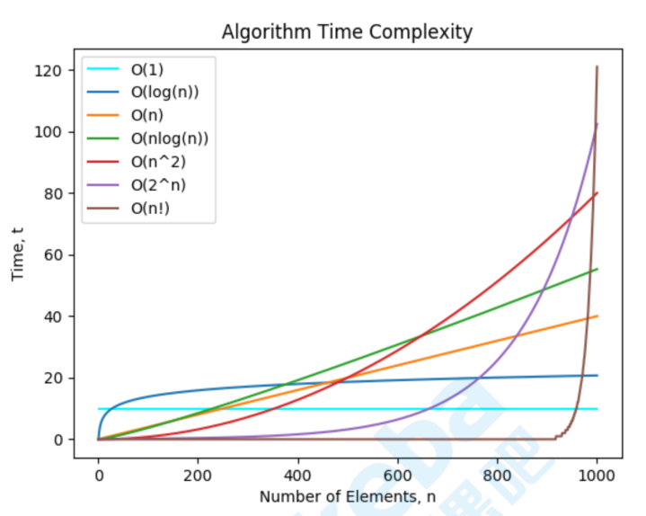

## 前端算法和数据结构

### 复杂度

O的概念，来描述算法的复杂度，简⽽⾔之，就是算法执⾏所需要的执⾏次数，和数据量的关系( 时间复杂度)， 占⽤额外空间和数据量的关系(空间复杂度)

`O(1)` : 常数复杂度 (和数据量⽆关) 

`O(log n)` :对数复杂度 (每次⼆分) 

`O(n)` : 线性时间复杂度 （数组遍历⼀次） 

`O(n*log n)` : 线性对数 （遍历+⼆分） 

`O(n^2)` : 平⽅ 两层遍历 

`O(n^3)` : 立方

`O(2^n)` : 指数 

`O(n!)` : 阶乘

### 稳定性

数组中[ {name:'xx', age:12}, {name:'yy', age:12}] 如果按照age排序，排序后，xx和yy的相对位置不变，我们成为稳定的算法，否则不稳定

### 排序

搜索和排序，是计算机的⼏个基本问题

#### 冒泡

最经典和简单粗暴的排序算法，简⽽⾔之，就是挨个对⽐，如果⽐右边的数字⼤，就交换位置 遍历⼀次，最⼤的在最右边，重复步骤，完成排序