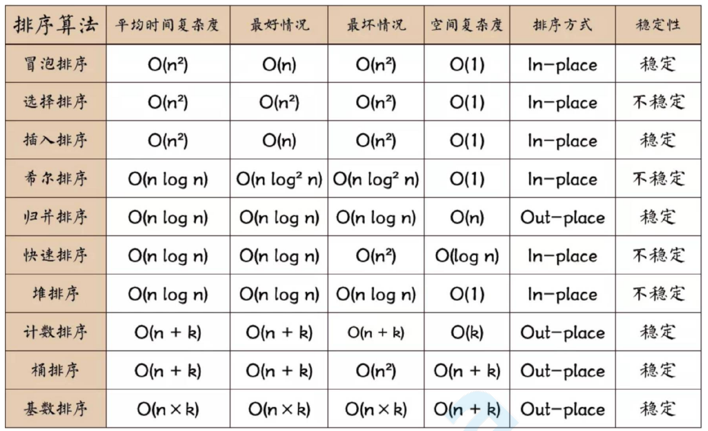

## 前端算法和数据结构

### 复杂度

O的概念，来描述算法的复杂度，简⽽⾔之，就是算法执⾏所需要的执⾏次数，和数据量的关系( 时间复杂度)， 占⽤额外空间和数据量的关系(空间复杂度)

`O(1)` : 常数复杂度 (和数据量⽆关) 

`O(log n)` :对数复杂度 (每次⼆分) 

`O(n)` : 线性时间复杂度 （数组遍历⼀次） 

`O(n*log n)` : 线性对数 （遍历+⼆分） 

`O(n^2)` : 平⽅ 两层遍历 

`O(n^3)` : 立方

`O(2^n)` : 指数 

`O(n!)` : 阶乘


### 稳定性

数组中[ {name:'xx', age:12}, {name:'yy', age:12}] 如果按照age排序，排序后，xx和yy的相对位置不变，我们成为稳定的算法，否则不稳定

### 排序

搜索和排序，是计算机的⼏个基本问题

#### 冒泡

最经典和简单粗暴的排序算法，简⽽⾔之，就是挨个对⽐，如果⽐右边的数字⼤，就交换位置 遍历⼀次，最⼤的在最右边，重复步骤，完成排序

```js
function bubleSort(arr) {
    var len = arr.length
    for (let outer = len; outer >= 2; outer--) {
        for (let inner = 0; inner <= outer - 1; inner++) {
            if (arr[inner] > arr[inner + 1]) {
                [arr[inner], arr[inner + 1]] = [arr[inner + 1], arr[inner]]
            }
        }
    }
    return arr
}
console.log(bubleSort([4, 3, 6, 1, 9, 6, 2]))
```

问题：冒泡复杂度和稳定性如何 

n^2 空间 1 稳定

#### 插⼊

插⼊排序逻辑和冒泡类似，只不过没采⽤挨个交换的逻辑，⽽是在⼀个已经排好序的数组⾥，插⼊⼀个元素，让它依然是有序的

```js
function insertSort(arr) {
    for (let i = 1; i < arr.length; i++) { //外循环从1开始，默认arr[0]是有序段
        for (let j = i; j > 0; j--) { //j = i,将arr[j]依次插⼊有序段中
            if (arr[j] < arr[j - 1]) {
                [arr[j], arr[j - 1]] = [arr[j - 1], arr[j]];
            } else {
                break;
            }
        }
    }
    return arr;
}
console.log(insertSort([11, 4, 3, 6, 1, 9, 7, 2, 0]))
```

n^2 空间 1 稳定

#### 快速排序

这个逼格略⾼，使⽤了⼆分的思想。可以算最重要的排序算法了 

⼤概就是找⼀个标志位，先遍历⼀次，所有个头⽐他矮的，都站左边，⽐他个头⾼的，都站右边，遍历⼀次，就把数组分成两部分，然后两遍的数组，递归执⾏相同的逻辑

```js
function quickSort(arr) {
    if (arr.length <= 1) {
        return arr; //递归出⼝
    }
    var left = [],
        right = [],
        current = arr.splice(0, 1); //注意splice后，数组⻓度少了⼀个
    for (let i = 0; i < arr.length; i++) {
        if (arr[i] < current) {
            left.push(arr[i]) //放在左边
        } else {
            right.push(arr[i]) //放在右边
        }
    }
    return quickSort(left).concat(current, quickSort(right)); //递归
}
```

上⾯⽅便理解，额外占⽤空间, 原地快拍

```js
// 原地版
function quickSort1(arr, low = 0, high = arr.length - 1) {
    if (low >= high) return
    let left = low
    let right = high
    let temp = arr[left]
    while (left < right) {
        if (left < right && temp <= arr[right]) {
            right--
        }
        arr[left] = arr[right]
        if (left < right && temp >= arr[left]) {
            left++
        }
        arr[right] = arr[left]
    }
    arr[left] = temp
    quickSort1(arr, low, left - 1)
    quickSort1(arr, left + 1, high)
    return arr
}
console.log(quickSort1([11, 4, 3, 6, 1, 9, 7, 2, 0]))
```

n*logn 空间 不稳定

其他排序算法还有很多，桶排序，堆排序等，还有⼀个容易挨揍的排序

```js
const list = [11, 4, 3, 6, 1, 9, 7, 2, 0]
const newList = []
list.forEach(item => {
    setTimeout(function () {
        newList.push(item)
        if (newList.length === list.length) {
            console.log(newList)
        }
    }, item * 100)
})
```


### 递归

快排我们了解到，递归就是⾃⼰调⽤⾃⼰，形成⼀个调⽤栈，逐渐缩⼩⽬标，到达截⽌条件返回执⾏的 

逻辑，talk is cheap，举个⼩例⼦

#### 数组打平 （扁平化）

```js
Array.prototype.flat = function () {
    var arr = [];
    this.forEach((item, idx) => {
        if (Array.isArray(item)) {
            arr = arr.concat(item.flat()); //递归去处理数组元素
        } else {
            arr.push(item) //⾮数组直接push进去
        }
    })
    return arr; //递归出⼝
}
arr = [1, 2, 3, [4, 5, [6, 7, [8, 9]]], [10, 11]]
console.log(arr.flat())
```

#### 爬楼

有⼀楼梯共10级，刚开始时你在第⼀级，若每次只能跨上⼀级或⼆级，要⾛上第10级，共有多少种⾛法？ 

其实就是个斐波那契数列，，只有两种⽅式 从第9层上⼀级，或者从第8级上⼆级， 9和8⼜各⾃⼜两种 

情况最后推到3级解题，的两种⽅式1和2 是固定的次数

```js
function stairs(n) {
    if (n === 0) {
        return 1;
    } else if (n < 0) {
        return 0
    }
    else {
        return stairs(n - 1) + stairs(n - 2)
    }
}
console.log(stairs(10))
```

