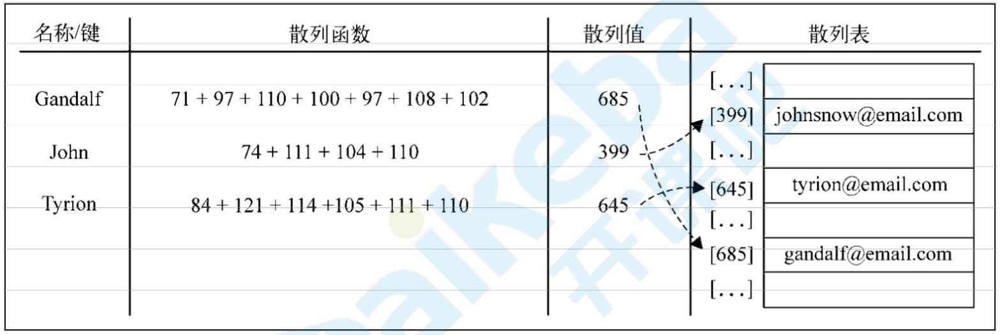
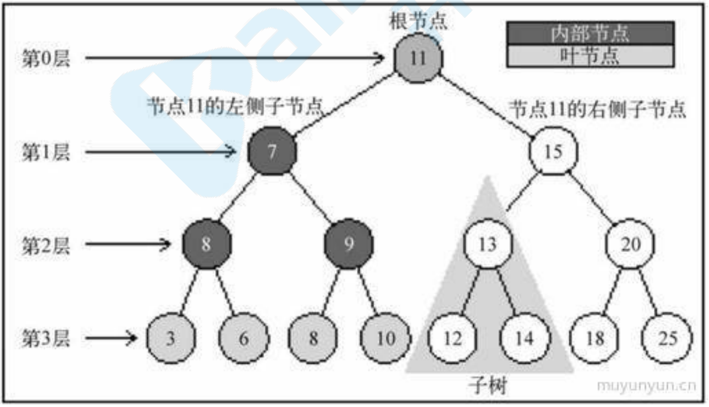

## 前端算法和数据结构

### 复杂度

O的概念，来描述算法的复杂度，简⽽⾔之，就是算法执⾏所需要的执⾏次数，和数据量的关系( 时间复杂度)， 占⽤额外空间和数据量的关系(空间复杂度)

`O(1)` : 常数复杂度 (和数据量⽆关) 

`O(log n)` :对数复杂度 (每次⼆分) 

`O(n)` : 线性时间复杂度 （数组遍历⼀次） 

`O(n*log n)` : 线性对数 （遍历+⼆分） 

`O(n^2)` : 平⽅ 两层遍历 

`O(n^3)` : 立方

`O(2^n)` : 指数 

`O(n!)` : 阶乘


### 稳定性

数组中[ {name:'xx', age:12}, {name:'yy', age:12}] 如果按照age排序，排序后，xx和yy的相对位置不变，我们成为稳定的算法，否则不稳定

### 排序

搜索和排序，是计算机的⼏个基本问题

#### 冒泡

最经典和简单粗暴的排序算法，简⽽⾔之，就是挨个对⽐，如果⽐右边的数字⼤，就交换位置 遍历⼀次，最⼤的在最右边，重复步骤，完成排序

```js
function bubleSort(arr) {
    var len = arr.length
    for (let outer = len; outer >= 2; outer--) {
        for (let inner = 0; inner <= outer - 1; inner++) {
            if (arr[inner] > arr[inner + 1]) {
                [arr[inner], arr[inner + 1]] = [arr[inner + 1], arr[inner]]
            }
        }
    }
    return arr
}
console.log(bubleSort([4, 3, 6, 1, 9, 6, 2]))
```

问题：冒泡复杂度和稳定性如何 

n^2 空间 1 稳定

#### 插⼊

插⼊排序逻辑和冒泡类似，只不过没采⽤挨个交换的逻辑，⽽是在⼀个已经排好序的数组⾥，插⼊⼀个元素，让它依然是有序的

```js
function insertSort(arr) {
    for (let i = 1; i < arr.length; i++) { //外循环从1开始，默认arr[0]是有序段
        for (let j = i; j > 0; j--) { //j = i,将arr[j]依次插⼊有序段中
            if (arr[j] < arr[j - 1]) {
                [arr[j], arr[j - 1]] = [arr[j - 1], arr[j]];
            } else {
                break;
            }
        }
    }
    return arr;
}
console.log(insertSort([11, 4, 3, 6, 1, 9, 7, 2, 0]))
```

n^2 空间 1 稳定

#### 快速排序

这个逼格略⾼，使⽤了⼆分的思想。可以算最重要的排序算法了 

⼤概就是找⼀个标志位，先遍历⼀次，所有个头⽐他矮的，都站左边，⽐他个头⾼的，都站右边，遍历⼀次，就把数组分成两部分，然后两遍的数组，递归执⾏相同的逻辑

```js
function quickSort(arr) {
    if (arr.length <= 1) {
        return arr; //递归出⼝
    }
    var left = [],
        right = [],
        current = arr.splice(0, 1); //注意splice后，数组⻓度少了⼀个
    for (let i = 0; i < arr.length; i++) {
        if (arr[i] < current) {
            left.push(arr[i]) //放在左边
        } else {
            right.push(arr[i]) //放在右边
        }
    }
    return quickSort(left).concat(current, quickSort(right)); //递归
}
```

上⾯⽅便理解，额外占⽤空间, 原地快拍

```js
// 原地版
function quickSort1(arr, low = 0, high = arr.length - 1) {
    if (low >= high) return
    let left = low
    let right = high
    let temp = arr[left]
    while (left < right) {
        if (left < right && temp <= arr[right]) {
            right--
        }
        arr[left] = arr[right]
        if (left < right && temp >= arr[left]) {
            left++
        }
        arr[right] = arr[left]
    }
    arr[left] = temp
    quickSort1(arr, low, left - 1)
    quickSort1(arr, left + 1, high)
    return arr
}
console.log(quickSort1([11, 4, 3, 6, 1, 9, 7, 2, 0]))
```

n*logn 空间 不稳定

其他排序算法还有很多，桶排序，堆排序等，还有⼀个容易挨揍的排序

```js
const list = [11, 4, 3, 6, 1, 9, 7, 2, 0]
const newList = []
list.forEach(item => {
    setTimeout(function () {
        newList.push(item)
        if (newList.length === list.length) {
            console.log(newList)
        }
    }, item * 100)
})
```


### 递归

快排我们了解到，递归就是⾃⼰调⽤⾃⼰，形成⼀个调⽤栈，逐渐缩⼩⽬标，到达截⽌条件返回执⾏的 

逻辑，talk is cheap，举个⼩例⼦

#### 数组打平 （扁平化）

```js
Array.prototype.flat = function () {
    var arr = [];
    this.forEach((item, idx) => {
        if (Array.isArray(item)) {
            arr = arr.concat(item.flat()); //递归去处理数组元素
        } else {
            arr.push(item) //⾮数组直接push进去
        }
    })
    return arr; //递归出⼝
}
arr = [1, 2, 3, [4, 5, [6, 7, [8, 9]]], [10, 11]]
console.log(arr.flat())
```

#### 爬楼

有⼀楼梯共10级，刚开始时你在第⼀级，若每次只能跨上⼀级或⼆级，要⾛上第10级，共有多少种⾛法？ 

其实就是个斐波那契数列，，只有两种⽅式 从第9层上⼀级，或者从第8级上⼆级， 9和8⼜各⾃⼜两种 

情况最后推到3级解题，的两种⽅式1和2 是固定的次数

```js
function stairs(n) {
    if (n === 0) {
        return 1;
    } else if (n < 0) {
        return 0
    }
    else {
        return stairs(n - 1) + stairs(n - 2)
    }
}
console.log(stairs(10))
```

#### 查找

查找比较简单，我们先来看一个经典的二分查找 有点类似幸运52的猜价格，比如让你在1和1000之间猜个数字，挨个猜是很蠢的，要先猜500，如果大了，那就是0~500 ，每次问题减半，很快就能查到

```js
function binarySearch(arr, target) {
    var low = 0,
        high = arr.length - 1,
        mid;
    while (low <= high) {
        mid = Math.floor((low + high) / 2);
        if (target === arr[mid]) {
            return `找到了了${target},在第${mid + 1}个`
        }
        if (target > arr[mid]) {
            low = mid + 1;
        } else if (target < arr[mid]) {
            high = mid - 1;
        }
    }
    return -1
}
console.log(binarySearch([1, 2, 3, 4, 5, 7, 9, 11, 14, 16, 17, 22, 33, 55, 65], 4))
```

递归版本

```js
function binarySearch1(arr, target, low = 0, high = arr.length - 1) {
    const n = Math.floor((low + high) / 2);
    const cur = arr[n];
    if (cur === target) {
        return `找到了了${target},在第${n + 1}个`;
    } else if (cur > target) {
        return binarySearch1(arr, target, low, n - 1);
    } else if (cur < target) {
        return binarySearch1(arr, target, n + 1, high);
    }
    return -1;
}
```

### 数据结构

#### 队列

这个很好理解 先入先出，有点像排队，通过数组push和shift模拟，通常用作任务管理理

#### 栈

先入后出

```js
class Stack {
    constructor() {
        this.items = []
    }
    push(item) {
        this.items.push(item)
    }
    pop() {
        return this.items.pop()
    }
    size() {
        return this.items.length
    }
    clear() {
        this.items = []
    }
}
```

- 索引: O(n) 
- 搜索: O(n) 
- 插⼊: O(1) 
- 移除: O(1)

经典案例： 括号匹配，html标签匹配，表达式计算

```js
function isBalance(symbol) {
    const stack = new Stack()
    const left = '{('
    const right = '})'
    let popValue
    let tag = true

    const match = function (popValue, current) {
        if (left.indexOf(popValue) !== right.indexOf(current)) {
            tag = false
        }
    }

    for (let i = 0; i < symbol.length; i++) {
        if (left.includes(symbol[i])) {
            stack.push(symbol[i])
        } else if (right.includes(symbol[i])) {
            popValue = stack.pop()
            match(popValue, symbol[i])
        }
    }
    return tag
}
console.log(isBalance('{{(({}))}}'))
console.log(isBalance('{{(({})}}'))
```

#### 链表

有点像⽕⻋，⻋厢和⻋厢之间链接，有点是可以随时替换⻋厢，react最新架构的fifiber，就是从树变成了链表，能够让diff任务随时中断


```js
class Node {
    constructor(element) {
        this.element = element
        this.next = null
    }
}
class LinkedList {
    constructor() {
        this.head = null
        this.current
        this.length = 0
    }
    append(element) {
        const node = new Node(element)
        if (this.head === null) { // 插⼊第⼀个链表
            this.head = node
        } else {
            this.current = this.head
            while (this.current.next) { // 找到最后⼀个节点
                this.current = this.current.next
            }
            this.current.next = node
        }
        this.length++
    }
    // 移除指定位置元素
    removeAt(position) {
        if (position > -1 && position < this.length) {
            let previous
            let index = 0
            if (position === 0) { // 如果是第⼀个链表的话, 特殊对待
                this.head = this.head.next
            } else {
                this.current = this.head
                while (index < position) { // 循环找到当前要删除元素的位置
                    previous = this.current
                    this.current = this.current.next
                    index++
                }
                previous.next = this.current.next
            }
            this.length--
        }
    }
    // 在指定位置加⼊元素
    insert(position, element) {
        const node = new Node(element)
        let index = 0
        let current, previous
        if (position > -1 && position < this.length + 1) {
            if (position === 0) { // 在链表最前插⼊元素
                current = this.head
                this.head = node
                this.head.next = current
            } else {
                current = this.head
                while (index < position) { // 同 removeAt 逻辑, 找到⽬标位置
                    previous = current
                    current = current.next
                    index++
                }
                previous.next = node // 在⽬标位置插⼊相应元素
                node.next = current
            }
            this.length++
        }
    }

    // 链表中是否含有某个元素, 如果有的话返回相应位置, ⽆的话返回 -1
    indexOf(element) {
        let index = 0
        this.current = this.head
        while (index < this.length) {
            if (this.current.element === element) {
                return index
            }
            this.current = this.current.next
            index++
        }
        return -1
    }
    // 移除某元素
    remove(element) {
        const position = this.indexOf(element)
        this.removeAt(position)
    }

    // 获取⼤⼩
    size() {
        return this.length
    }

    // 获取最开头的链表
    getHead() {
        return this.head
    }

    // 是否为空
    isEmpty() {
        return this.length === 0
    }

    // 打印链表元素
    log() {
        this.current = this.head
        let str = this.current.element
        while (this.current.next) {
            this.current = this.current.next
            str = str + ' ' + this.current.element
        }
        console.log(str)
        return str
    }
}

// 测试⽤例
var linkedList = new LinkedList()
linkedList.append(5)
linkedList.append(10)
linkedList.append(15)
linkedList.append(20)
linkedList.log() // '5 10 15 20'
linkedList.removeAt(1)
linkedList.log() // '5 15 20'
linkedList.insert(1, 10)
linkedList.log()
```

时间复杂度:

- 索引: O(n) 
- 搜索: O(n) 
- 插⼊: O(1) 
- 移除: O(1)

#### 集合

其实就是es6的set，特点就是没有重复数据，也可以⽤数组模拟

```js
// 其实就是es6的set，特点就是没有重复数据，也可以⽤数组模拟
class Set {
    constructor() {
        this.items = {}
    }
    has(value) {
        return this.items.hasOwnProperty(value)
    }
    add(value) {
        if (!this.has(value)) {
            this.items[value] = value
            return true
        }
        return false
    }
    remove(value) {
        if (this.has(value)) {
            delete this.items[value]
            return true
        }
        return false
    }
    get size() {
        return Object.keys(this.items).length
    }
    get values() {
        return Object.keys(this.items)
    }
}
const set = new Set()
set.add(1)
console.log(set.values) // ["1"]
console.log(set.has(1)) // true
console.log(set.size) // 1
set.add(2)
console.log(set.values) // ["1", "2"]
console.log(set.has(2)) // true
console.log(set.size) // 2
set.remove(1)
console.log(set.values) // ["2"]
set.remove(2)
console.log(set.values) // []
```

#### 哈希表

哈⻄其实就是js⾥的对象，它在实际的键值和存⼊的哈希值之间存在⼀层映射。如下例⼦:



```js
class HashTable {
    constructor() {
        this.items = {}
    }
    put(key, value) {
        const hash = this.keyToHash(key)
        this.items[hash] = value
    }
    get(key) {
        return this.items[this.keyToHash(key)]
    }
    remove(key) {
        delete (this.items[this.keyToHash(key)])
    }
    keyToHash(key) {
        let hash = 0
        for (let i = 0; i < key.length; i++) {
            hash += key.charCodeAt(i)
        }
        hash = hash % 37 // 为了避免 hash 的值过⼤
        return hash
    }
}
let table = new HashTable()
table.put('name', 'mytable')
table.put('age', '6')
table.put('best', 'jack')
console.log(table.get('name'))
console.log(table.get('best'))
table.remove('name')
console.log(table.get('name'))
```

哈希的问题也很明显，⽐如两个数的hash值⼀样的时候，会发⽣碰撞，可以⽤存储链表的⽅式来解决(重复的值存在链表⾥) 这些V8帮我们处理的很好了

#### 树


我们浏览器的dom 就是经典的树结构 

这幅图中有如下概念: 

- 根节点: ⼀棵树最顶部的节点 
- 内部节点: 在它上⾯还有其它内部节点或者叶节点的节点 
- 叶节点: 处于⼀棵树根部的节点
- ⼦树: 由树中的内部节点和叶节点组成 

我们其实可以不⽤模拟，dom操作就是树

dom遍历

```html
<body>
    <div id="app">
        <div>123</div>
        <p>2345</p>
        <div class="demo">
            <span>哈喽</span>
        </div>
    </div>
    <script>
        function walk(node, func = () => { }) {
            if (node instanceof window.Node) {
                _walk(node, func);
            }
            return node;
        }
        function _walk(node, func) {
            if (func(node) !== false) {
                node = node.firstChild;
                while (node) {
                    _walk(node, func);
                    node = node.nextSibling;
                }
            }
        }
        walk(document.getElementById('app'), node => {
            console.log(node)
        })
    </script>
</body>
```

### 动态规划

动态规划是⼀种常⻅的「算法设计技巧」，并没有什么⾼深莫测，⾄于各种⾼⼤上的术语，那是吓唬别⼈⽤的，只要你亲⾃体验⼏把，这些名词的含义其实显⽽易⻅，再简单不过了。 ⾄于为什么最终的解法看起来如此精妙，是因为动态规划遵循⼀套固定的流程：递归的暴⼒解法 -> 带 备忘录的递归解法 -> ⾮递归的动态规划解法。这个过程是层层递进的解决问题的过程，你如果没有前⾯的铺垫，直接看最终的⾮递归动态规划解法，当然会觉得⽜逼⽽不可及了。举个⼩栗⼦，斐波那契数列

#### 暴力递归**fifib**

```js
function fib(n) {
    if (n == 1 || n == 2) return 1
    return fib(n - 1) + fib(n - 2)
}
```

递归调⽤很复杂，⽐如fifib(18) 左边和右边就重复计算了 

递归算法的时间复杂度怎么计算？⼦问题个数乘以解决⼀个⼦问题需要的时间。

⼦问题个数，即递归树中节点的总数。显然⼆叉树节点总数为指数级别，所以⼦问题个数为 O(2^n)。解决⼀个⼦问题的时间，在本算法中，没有循环，只有 f(n - 1) + f(n - 2) ⼀个加法操作，时间为 O(1)。所以，这个算法的时间复杂度为 O(2^n)，指数级别，爆炸。 基本上30，40

#### 中间存储**fifib**

明确了问题，其实就已经把问题解决了⼀半。即然耗时的原因是重复计算，那么我们可以造⼀个「备忘录」，每次算出某个⼦问题的答案后别急着返回，先记到「备忘录」⾥再返回；每次遇到⼀个⼦问题先 去「备忘录」⾥查⼀查，如果发现之前已经解决过这个问题了，直接把答案拿出来⽤，不要再耗时去计算了。 

⼀般使⽤⼀个数组充当这个「备忘录」，当然你也可以使⽤哈希表（字典），思想都是⼀样的。