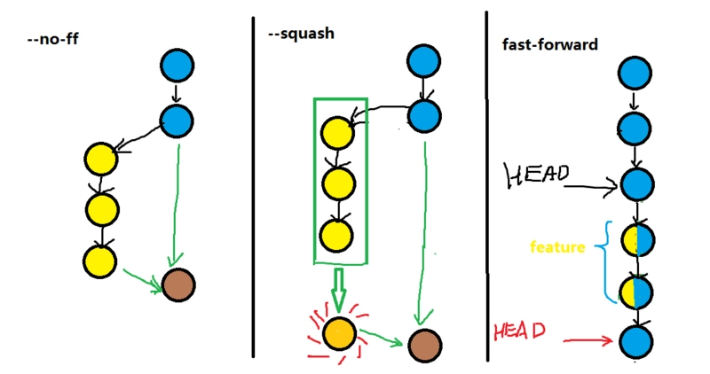
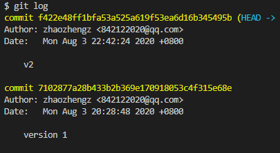
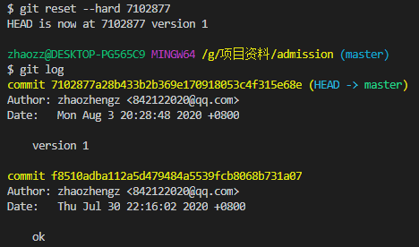
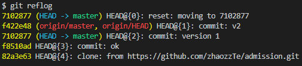
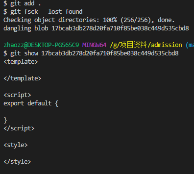

## 创建仓库

创建仓库分为两种情况

1. 直接克隆 git 服务器建好的仓库
2. 本地先初始化仓库后管理 git 服务器仓库

### 直接克隆

```bash
git clone git@git.github.com:xxx/xxxx.git
touch README.md
git add README.md
git commit -m "add README"
git push -u origin master   //-u是--set-upstream的简写目的是关联本地和远程本质
```

### 本地先初始化

这种情况需要初始化一个本地仓库，然后，将本地仓库的源指向服务器

```bash
git init
git remote add origin git@opensource.github.com:qwe/qwe.git
touch README.md
git add README.md
git commit -m "add README"
git push -u origin master
```

## 创建分支

1. 以本地分支为基础创建分支
2. 以远程分支为基础创建分支

### 以本地分支为基础

创建分支时，以本地当前所在的分支为基础，创建分支

```bash
git branch <branchName>       //新建分支
git checkout -b <branchName>  //新建分支并切换到新分支
```

这种情况如果你本地的分支有已 commit 但未提交的代码，会被一并 clone 过来

### 以远程分支为基础

创建分支时，可以指定远程某个分支为基础，创建分支，这种创建方式创建本地分支后，本地分支会自动与远程分支进行关联

```bash
git checkout --track origin/<branchName>        //以远程分支为名创建本地分支
git checkout -b <branchName> origin/<branchName>    //可以指定本地分支名
```

## 提交代码

```bash
git add <file>
git commit -m "xxx"
git pull origin <branchName> //如果是需要推送到远程新的分支可以忽略这一步
git push origin <branchName>
```

## 查看日志

### 常用参数

- `--pretty=oneline`以一行显示
- `-p`显示每个文件的详细信息

### 常用命令

- `git log`查看所有历史
- `git log `查看某个文件的提交历史
- `git show `查看某次 commit 的提交记录
- `git log --graph`查看分支生命周期

## 代码回滚

### git reset

`git reset `将分支的头部指向这次 commit，默认会将被撤销的 commit 记录保留在你的暂存区

`git reset --hard `被撤销的 commit 记录保留不会被保留

`git push origin HEAD --force `强推到远程

### git revert

`git revert `用一次相反的提交覆盖原来的代码，达到回滚的目的。这种方式更灵活，可以针对某一次的 commit 进行回滚

## 分支合并



```bash
当前所在分支为所需合并到的分支
git merge <branchName>
git merge --no-ff <branchName>
git merge --squash <branchName>
```

### 当发生冲突时

- 撤销这次合并，将分支初始化到合并前的状态 `git merge --abort`
- 解决冲突后，`git add`命令把文件添加到暂存区。继续执行`git merge --continue`命令编辑新生成的提交的 log 信息。然后 merge 完成。

## tag

```bash
git tag     //查看tag
git tag test_tag c809ddbf83939a89659e51dc2a5fe183af384233//在某个commit 上打tag
git tag
git push origin test_tag//!!!本地tag推送到线上
git tag -d test_tag//本地删除tag
git push origin :refs/tags/test_tag//本地tag删除了，再执行该句，删除线上tag
```

## 一些其他的常用命令

- `git checkout .`清除工作区所有尚未 add 的文件
- `git checkout -- `清除工作某个尚未 add 的文件
- `git reset HEAD `清除工作某个已 add 的文件
- `git branch --set-upstream-to=origin/remote_branch your_branch`手动关联本地与远程分支
- `git checkout --ours .` 当发生冲突时全部采用传入的修改
- `git checkout --theirs .`当发生冲突时全部采用本地的修改
- `git push origin --delete `删除远程分支
- `git diff   --stat`查看两个分支有差异的文件
- `git diff   `查看两个分支具体某个文件的差异
- `git diff  ` 查看两个分支所有文件的差异
- `git remote update`获取远程最新分支
- `git remote prune origin --dry-run`查看是否有已被删除的远程分支
- `git remote prune origin` 修剪远程已被删除的分支
- `git commit --amend` 修改最近一次的提交信息，并且将已 add 的修改合并到一个 commit 中

## git rebase

对**commit**进行各种修改

### 操作步骤

1. 选择操作的起点位置，`git rebase -i SHA1`
2. 指定每个节点的操作方式，保留/删除/修改/...，进入操作
3. 进入下一步操作/终止操作，`git rebase --continue`，`git rebase --abort`

### 例子

比如要修改 B 节点的 commit 信息，则需要进去 B 节点之前的 A 节点

```bash
git rebase -i A节点的hash值
```

此时会进入一个交互窗口

```bash
pick B 0406b6
pick C 39a9c2
pick D 3131e0
```

修改节点前对应的操作，然后保存，就可以对节点进行编辑

操作指令有：

- `pick`，保留节点，不做任何变更
- `edit`，保留节点，修改内容
- `drop`，删除节点，删除本次提交
- `reword`，保留节点，修改提交信息
- `squash`，保留节点修改，并且与上一个节点合并，也就是两次提交并做一次
- `fixup`，保留节点修改，忽略本次提交信息
- `exec`，run command (the rest of the line) using shell

用的比较多的是前三个，可以只关注前三个。我们需要修改下交互窗口的内容，改为（第二步）：

```bash
+ edit B 0406b6
- pick B 0406b6
pick C 39a9c2
pick D 3131e0
```

上面是 diff，实际内容是：

```bash
edit B 0406b6
pick C 39a9c2
pick D 3131e0
```

此时会进入一个临时 git 分支，大致是这样：

```bash
branch(0406b6):
```

由于你告诉了 git 要对 B 节点就行修改，所以它就停在了 B 处理，等着你修改，此时，你可以通过 amend 命令修改提交信息：

```bash
branch(0406b6): git commit --amend
# 进入交互窗口，将 commit 信息修改为 push B
```

操作完成后，执行（第三步）：

```bash
git rebase --continue
```

由于你告诉 git 只需要操作一个节点，所以它会回到最初的位置<当前>，否则的话，它会继续进入下一个临时 git 分支。当然，如果你进入第三步以后，突然又不想修改了，可以执行：

```bash
git rebase --skip
```

## git stash

> git stash 用于将当前工作区的修改暂存起来，就像堆栈一样，可以随时将某一次缓存的修改再重新应用到当前工作区。一旦用好了这个命令，会极大提高工作效率。

注意：`git stash`只可以暂存被`git`跟踪的文件，新建的文件无法被跟踪，需要先`git add`

### git stash

将**缓存区**的内容保存到**暂存区**

`git stash`可以暂存多个内容

### git stash pop stash@{x}

将**暂存区**的弹出到**缓存区**，弹出前，需要`git checkout`**缓存区**和**暂存区**冲突的内容

可指定`pop`某个**暂存区**的内容

### git stash list

查看**暂存区**的内容列表

```bash
$ git stash list
stash@{0}: WIP on master: ef3879c 新功能(小): a
stash@{1}: WIP on master: ef3879c 新功能(小): a
```

### git stash apply stash@{x}

使用指定一个**暂存区**的内容

### git stash show stash@{x}

查看某个**暂存区**的内容。默认查看第一个

加上`-p`可以查看详情

### git stash save

将内容保存到**暂存区**时打上一个标记，方便查找

```bash
git stash save 'test'
```

### **git stash drop** stash@{x}

丢弃**暂存区**的内容，从列表中删除这个存储

### git stash clear

删除所有缓存的`stash`

## 时光穿梭

我们常常在开发时会遇到这种情况：当对当前的版本不满意，打算从上一个或上几个版本重新开始时， 我们会使用git log命令查看版本提交的commit记录； 我已经提交了2个版本，***\*commit一行后的代码是版本的唯一标识，我们可以通过它到任何一个我们想要的版本\****。注意：最新的一个版本是当前版本，上一个版本是指第2个对应的版本。 



这时，我们用

  ***\*git reset --hard 7102877\****

回到上一个版本（可以不用输入整个一大串，git会自动查找，只要能唯一识别版本就行）

这个时候再git log看一下  只剩下最初提交的一个版本了！

上一个版本已经看不到了，而这时我们又后悔了，想回到回退前的版本，  还是一样的方法，前提是只要你还记得版本的ID，只要执行   `git reset --hard  f422e48`

 关机了，第二天才后悔，不记得ID了怎么办，git log之后已经没有最新版本的ID了 ,这个时候可以使用`git reflog`

git reflog记录了git的每一次版本更新的命令，我们执行之后就可以看到每次版本的ID。



git中使用HEAD表示当前版本，HEAD^表示上一个版本，上上一个版本是HEAD^^，回退到上一个版本只需要执行

`git reset --hard HEAD^`

上上个版本当然是

`git reset --hard HEAD^^`

## 错误操作导致代码丢失找回

某些情况下，代码丢失了，但对应的代码并没有commit，但由于有用git add，所以可以用 `git fsck --lost-found` 



 还有一个就是： 

```shell
find .git/objects -type f | xargs ls -lt | sed 60q
```

 找回本地仓库里边最近add的60个文件。 

 用编程软件查看，把它改名xxx.js之类的 

## git blame

 这个命令，我们可以查出某个文件的每一行内容到底是由哪位大神所写。也是解决“找出真凶”这个问题的快速方法 

```shell
git blame 文件名
```

如果只查文件中某一部分由谁所写：

```shell
git blame 文件名 | grep "查找词"
```

或者：

```shell
git blame 文件名 -L a,b
```

-L 参数表示后面接的是行号(Line)， a,b代表查询文件的第a行到第b行之间的文件内容情况。

a, 则代表从第a行到文件结尾

,b则代表从文件开头到第b行

