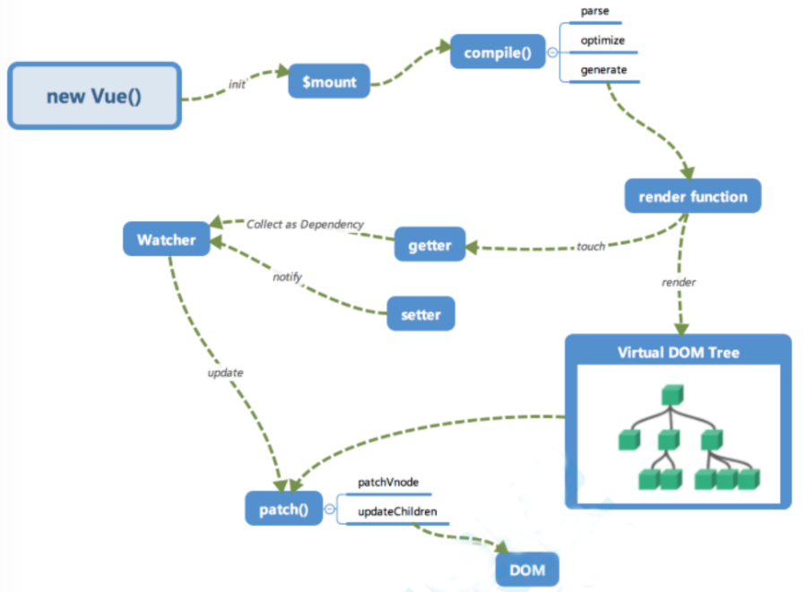
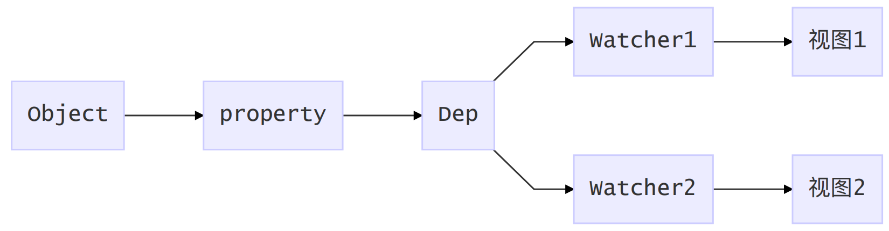
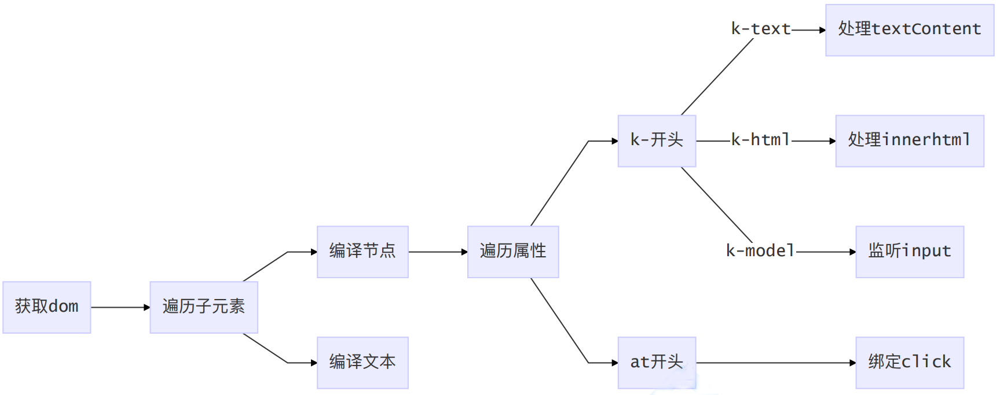
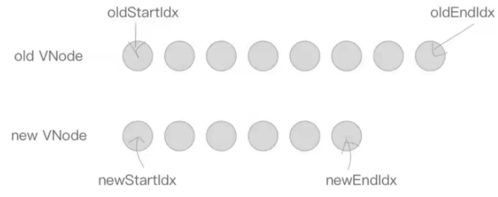
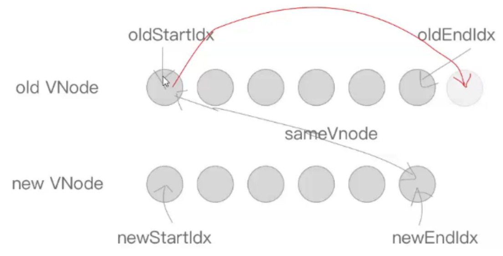
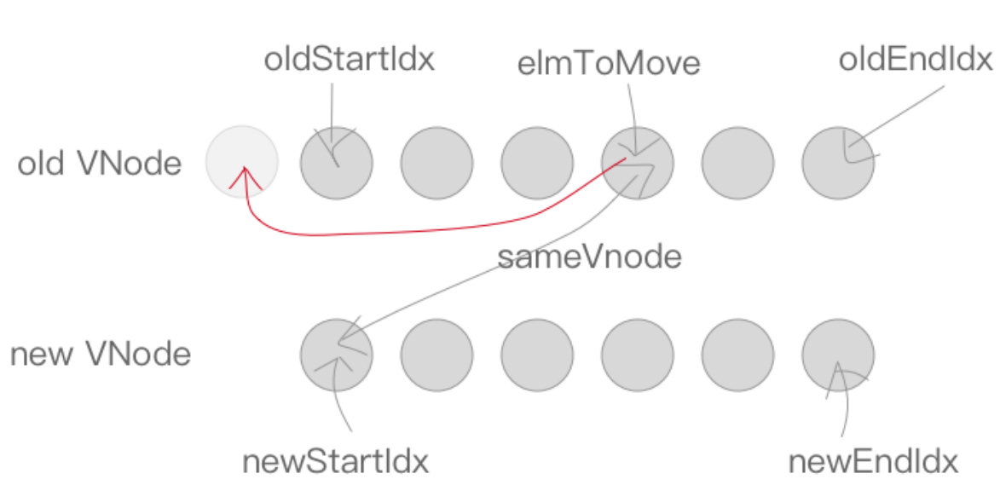
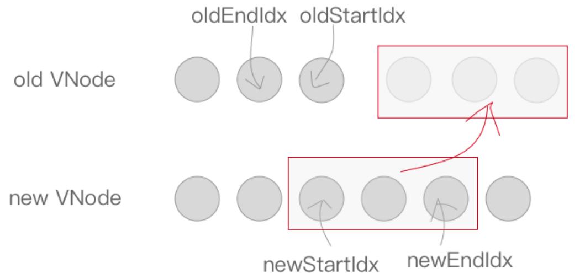
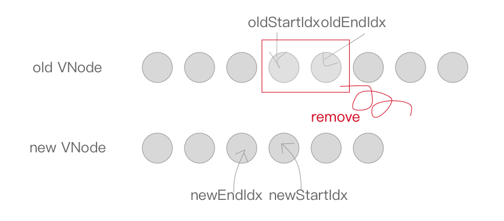

## Vue工作机制

### 初始化 

在 `new Vue()` 时会调用_init()进行初始化，会初始化各种实例方法、全局方法、执行⼀些⽣命周期、初始化props、data等状态。其中最重要的是data的「**响应化**」处理。 

初始化之后调用 `$mount` 挂载组件，主要执行编译和首次更新

### 编译 

编译模块分为三个阶段 

1. parse：使用正则解析template中的vue的指令(v-xxx) 变量等等 形成抽象语法树AST 
2. optimize：标记⼀些静态节点，用作后面的性能优化，在diff的时候直接略过 
3. generate：把第⼀部⽣成的AST 转化为渲染函数 render function

### 虚拟dom

Virtual DOM 是react首创，Vue2开始⽀持，就是用 JavaScript 对象来描述dom结构，数据修改的时候，我们先修改虚拟dom中的数据，然后数组做diff，最后再汇总所有的diff，力求做最少的dom操作，毕竟js里对比很快，而真实的dom操作太慢

```json
// vdom
{
 tag: 'div', 
 props:{
     name:'哈哈哈',
     style:{color:red},
     onClick:xx
 }
 children: [ 
     {
         tag: 'a', 
         text: 'click me' 
     }
 ]
}
```

```vue
<div name="哈哈哈" style="color:red" @click="xx">
 <a>
 	click me
 </a>
</div>
```

### 更新 

数据修改触发setter，然后监听器会通知进行修改，通过对比新旧vdom树，得到最小修改，就是 patch ，然后只需要把这些差异修改即可

### 实现zvue



```js
// 期待用法
// new ZVue({
// data:{msg:'hello'}
// })
class ZVue {
    constructor(options) {
        this.$options = options;
        //处理data选项
        this.$data = options.data;
        // 响应化
        this.observe(this.$data);
        // new Watcher();
        // this.$data.test;
        // new Watcher();
        // this.$data.foo.bar;
        new Compile(options.el, this);
        if (options.created) {
            options.created.call(this);
        }
    }
    observe(value) {
        if (!value || typeof value !== 'object') {
            return;
        }
        // 遍历对象
        Object.keys(value).forEach(key => {
            this.defineReactive(value, key, value[key])
            // 代理到vm上
            this.proxyData(key);
        })
    }
    proxyData(key) {
        Object.defineProperty(this, key, {
            get() {
                return this.$data[key];
            },
            set(newVal) {
                this.$data[key] = newVal;
            }
        })
    }
    defineReactive(obj, key, val) {
        const dep = new Dep();
        Object.defineProperty(obj, key, {
            get() {
                // 将Dep.target添加到dep中
                Dep.target && dep.addDep(Dep.target)
                return val;
            },
            set(newVal) {
                if (newVal !== val) {
                    val = newVal;
                    // console.log(`${key}更新了：${newVal}`);
                    dep.notify();
                }
            }
        })
        // 递归
        this.observe(val);
    }
}
class Dep {
    constructor() {
        this.deps = [];
    }
    addDep(dep) {
        this.deps.push(dep)
    }
    notify() {
        this.deps.forEach(dep => dep.update())
    }
}
class Watcher {
    constructor(vm, key, cb) {
        this.vm = vm;
        this.key = key;
        this.cb = cb;

        Dep.target = this;
        this.vm[this.key];// 添加watcher到dep
        Dep.target = null;
    }
    update() {
        // console.log('属性更新了');
        this.cb.call(this.vm, this.vm[this.key])
    }
}
```

property/Dep/Watcher对应关系

compile源码
编译过程图


```js
// new Compile(el, vm)
class Compile {
    constructor(el, vm) {
        this.$vm = vm;
        this.$el = document.querySelector(el);
        if (this.$el) {
            // 提取宿主中模板内容到Fragment标签，dom操作会提⾼高效率
            this.$fragment = this.node2Fragment(this.$el);
            // 编译模板内容，同时进行行行依赖收集
            this.compile(this.$fragment);
            this.$el.appendChild(this.$fragment);
        }
    }
    node2Fragment(el) {
        const fragment = document.createDocumentFragment();
        let child;
        while ((child = el.firstChild)) {
            fragment.appendChild(child);
        }
        return fragment;
    }
    compile(el) {
        const childNodes = el.childNodes;
        Array.from(childNodes).forEach(node => {
            // 判断节点类型
            if (node.nodeType === 1) {
                // element节点
                // console.log('编译元素节点'+node.nodeName);
                this.compileElement(node);
            } else if (this.isInterpolation(node)) {
                // 插值表达式
                // console.log('编译插值文文本'+node.textContent);
                this.compileText(node);
            }
            // 递归子子节点
            if (node.childNodes && node.childNodes.length > 0) {
                this.compile(node);
            }
        });
    }
    isInterpolation(node) {
        // 是文文本且符合{{}}
        return node.nodeType === 3 && /\{\{(.*)\}\}/.test(node.textContent);
    }
    compileElement(node) {
        // <div z-model="foo" z-text="test" @click="onClick">
        let nodeAttrs = node.attributes;
        Array.from(nodeAttrs).forEach(attr => {
            const attrName = attr.name;
            const exp = attr.value;
            if (this.isDirective(attrName)) {
                const dir = attrName.substring(2);
                console.log(111,dir);
                this[dir] && this[dir](node, this.$vm, exp);
            }
            if (this.isEvent(attrName)) {
                const dir = attrName.substring(1);
                this.eventHandler(node, this.$vm, exp, dir);
            }
        });
    }
    isDirective(attr) {
        return attr.indexOf("z-") === 0;
    }
    isEvent(attr) {
        return attr.indexOf("@") === 0;
    }
    compileText(node) {
        console.log(RegExp.$1);
        this.update(node, this.$vm, RegExp.$1, "text");
    }
    update(node, vm, exp, dir) {
        let updatrFn = this[dir + "Updater"];
        updatrFn && updatrFn(node, vm[exp]);
        // 依赖收集
        new Watcher(vm, exp, function (value) {
            updatrFn && updatrFn(node, value);
        });
    }
    text(node, vm, exp) {
        this.update(node, vm, exp, "text");
    }
    textUpdater(node, val) {
        node.textContent = val;
    }
}
```

测试代码

```vue
<!DOCTYPE html>
<html lang="en">

<head>
    <meta charset="UTF-8">
    <meta name="viewport" content="width=device-width, initial-scale=1.0">
    <meta http-equiv="X-UA-Compatible" content="ie=edge">
    <title>Document</title>
</head>

<body>
    <div id="app">
        <p>{{name}}</p>
        <p z-text="name"></p>
        <p>{{age}}</p>
        <p>
            {{doubleAge}}
        </p>
        <input type="text" k-model="name">
        <button @click="changeName">呵呵</button>
        <div z-html="html"></div>
    </div>
    <script src='./zvue.js'></script>
    <script src='./compile.js'></script>
    <script>
        const kaikeba = new ZVue({
            el: '#app',
            data: {
                name: "I am test.",
                age: 12,
                html: '<button>这是一个按钮</button>'
            },
            created() {
                console.log('开始啦')
                setTimeout(() => {
                    this.name = '我是测试'
                }, 1500)
            },
            methods: {
                changeName() {
                    this.name = '哈喽，world'
                    this.age = 1
                }
            }
        })
    </script>
    <!-- <script src="./zvue.js"></script>
<script>
const app = new KVue({
data: {
test: 'zzz',
foo: {bar:'bar'}
}
})
app.$data.test = '我变了了'
app.$data.foo.bar = '我变了了'
app.test = '我又又变了了'
</script> -->
</body>

</html>
```

## 源码解析

### v-html指令

```js
html(node, vm, exp) {
	this.update(node, vm, exp, "html");
}
htmlUpdater(node, value) {
	node.innerHTML = value;
}
```

### v-model指令

```js
model(node, vm, exp) {
    this.update(node, vm, exp, "model");
    node.addEventListener("input", e => {
    	vm[exp] = e.target.value;
	});
}
modelUpdater(node, value) {
	node.value = value;
}
```

### 事件监听

```js
compileElement(node) {
    let nodeAttrs = node.attributes;
    Array.from(nodeAttrs).forEach(attr => {
        // ...
        // 事件处理理
        if (attrName.indexOf("@") == 0) {
            // @click="handleClick"
            const dir = attrName.substring(1); // 事件名称
            // 事件监听处理理
            this.eventHandler(node, this.$vm, exp, dir);
        }
    });
}
// 事件处理理: 给node添加事件监听，dir-事件名称
// 通过vm.$options.methods[exp]可获得回调函数
eventHandler(node, vm, exp, dir) {
    let fn = vm.$options.methods && vm.$options.methods[exp];
    if (dir && fn) {
    	node.addEventListener(dir, fn.bind(vm));
    }
}
```

整理理启动顺序：
platforms/web/entry-runtime-with-compiler.js

```js
div#app
new Vue({
	template:dom
}).$mount('#app')
```

src\platforms\web\runtime\index.js

```ts
Vue.prototype.$mount = function (
  el?: string | Element,
  hydrating?: boolean
): Component {
  el = el && inBrowser ? query(el) : undefined
  return mountComponent(this, el, hydrating)
}
```

- mountComponent

src\core\index.js

```js
initGlobalAPI(Vue)
```

- initGlobalAPI
  set
  delete
  nextTick
  。。。

src\core\instance\index.js

构造函数

```js
import { initMixin } from './init'
import { stateMixin } from './state'
import { renderMixin } from './render'
import { eventsMixin } from './events'
import { lifecycleMixin } from './lifecycle'
import { warn } from '../util/index'

function Vue (options) {
  if (process.env.NODE_ENV !== 'production' &&
    !(this instanceof Vue)
  ) {
    warn('Vue is a constructor and should be called with the `new` keyword')
  }
  this._init(options)
}

initMixin(Vue)
stateMixin(Vue)
eventsMixin(Vue)
lifecycleMixin(Vue)
renderMixin(Vue)

export default Vue

```

- initMixin(Vue)

  ```js
  initLifecycle(vm)
  initEvents(vm)
  initRender(vm)
  callHook(vm, 'beforeCreate')
  initInjections(vm) // resolve injections before data/props
  initState(vm)
  initProvide(vm) // resolve provide after data/props
  callHook(vm, 'created')
  ```

  initLifecycle： children等
  initEvents：事件监听初始化
  initRender：定义$createElement
  initInjections: 获取注入入数据并做响应化
  initState：初始化props,methods,data,computed,watch等
  initProvide：注入入数据处理理

- stateMixin：实现 set,$delete
- eventsMixin(Vue)：实现 on..
- lifecycleMixin(Vue)：实现_update,  destroy_
- renderMixin(Vue)：_render $nextTick
  

### 数据响应式

initData src\core\instance\state.js

```js
proxy()
observe(data, true /* asRootData */)
```

observe src\core\observer\index.js

```js
ob = new Observer(value)
return ob
```

Observer
数组和对象响应化处理理逻辑

```js
/**
* 对象响应化
*/
walk (obj: Object) {}
/**
* 数组元素响应化
*/
observeArray (items: Array<any>) {}
```

defineReactive
数据拦截

```js
Object.defineProperty(obj, key, {
    enumerable: true,
    configurable: true,
    get: function reactiveGetter () {},
    set: function reactiveSetter (newVal) {}
})
```

Dep
watcher管理理

```js
depend () {
    if (Dep.target) {
    	Dep.target.addDep(this)
    }
}
```

Watcher src\core\observer\watcher.js
watcher和dep互相添加引用

```js
addDep (dep: Dep) {
    const id = dep.id
    if (!this.newDepIds.has(id)) {
        this.newDepIds.add(id)
        this.newDeps.push(dep)
        if (!this.depIds.has(id)) {
        	dep.addSub(this)
        }
    }
}
```

watcher更新逻辑：通常情况下会执行queueWatcher，执行异步更新

```js
update () {
    /* istanbul ignore else */
    if (this.lazy) {
    	this.dirty = true
    } else if (this.sync) {
    	this.run()
    } else {
    	queueWatcher(this)
    }
}
```

queueWatcher src\core\observer\scheduler.js
推入队列，下个刷新周期执行批量任务，这是vue异步更新实现的关键

```js
queue.push(watcher)
nextTick(flushSchedulerQueue)
```

nextTick将flushSchedulerQueue加入回调数组，启动timerFunc准备执行

```js
callbacks.push(() => cb.call(ctx))
timerFunc()
```

timerFunc指定了vue异步执行策略，根据执行环境，首选Promise，备选依次为：
MutationObserver、setImmediate、setTimeout

### 数组响应式

数组比较特别，它的操作方法不会触发setter，需要特别处理
Observer
把修改过的数组拦截方法替换到当前数组对象上可以改变其行为

```js
if (Array.isArray(value)) {
    if (hasProto) {
        //数组存在原型就覆盖其原型
        protoAugment(value, arrayMethods)
    } else {
        //不存在就直接定义拦截方方法
        copyAugment(value, arrayMethods, arrayKeys)
    }
    this.observeArray(value)
}
```

arrayMethods src\core\observer\array.js
修改数组7个变更方法使其可以发送更新通知

```js
methodsToPatch.forEach(function (method) {
  // cache original method
  const original = arrayProto[method]
  def(arrayMethods, method, function mutator (...args) {
    const result = original.apply(this, args)
    const ob = this.__ob__
    let inserted
    switch (method) {
      case 'push':
      case 'unshift':
        inserted = args
        break
      case 'splice':
        inserted = args.slice(2)
        break
    }
    if (inserted) ob.observeArray(inserted)
    // notify change
    ob.dep.notify()
    return result
  })
})
```

响应化
https://www.processon.com/view/link/5d1eb5a0e4b0fdb331d3798c

$mount src\platforms\web\runtime\index.js
挂载时执行mountComponent，将dom内容追加至el

```ts
Vue.prototype.$mount = function (
    el?: string | Element, // 可选参数
    hydrating?: boolean
): Component {
    el = el && inBrowser ? query(el) : undefined
    return mountComponent(this, el, hydrating)
}
```

mountComponent core/instance/lifecycle
创建组件更更新函数，创建组件watcher实例例

```js
updateComponent = () => {
    // ⾸先执行vm._render() 返回VNode
    // 然后VNode作为参数执行update做dom更新
    vm._update(vm._render(), hydrating)
}
new Watcher(vm, updateComponent, noop, {
    before () {
    	if (vm._isMounted && !vm._isDestroyed) {
        	callHook(vm, 'beforeUpdate')
        }
    }
}, true /* isRenderWatcher */)
```

_render() src\core\instance\render.js

获取组件vnode

```js
const { render, _parentVnode } = vm.$options;
vnode = render.call(vm._renderProxy, vm.$createElement);
```

_update src\core\instance\lifecycle.js
执行patching算法，初始化或更新vnode至$el

```js
if (!prevVnode) {
    // initial render
    // 如果没有⽼vnode，说明在初始化
    vm.$el = vm.__patch__(vm.$el, vnode, hydrating, false /* removeOnly */)
} else {
    // updates
    // 更新周期直接diff，返回新的dom
    vm.$el = vm.__patch__(prevVnode, vnode)
}
```

patch src\platforms\web\runtime\patch.js
定义组件实例补丁方法

```js
Vue.prototype.__patch__ = inBrowser ? patch : noop
```

createPatchFunction src\core\vdom\patch.js

创建浏览器平台特有patch函数，主要负责dom更新操作

```js
// 扩展操作：把通用模块和浏览器中特有模块合并
const modules = platformModules.concat(baseModules)
// ⼯⼚函数：创建浏览器器特有的patch函数，这里主要解决跨平台问题
export const patch: Function = createPatchFunction({ nodeOps, modules })
```

### patch

那么patch如何工作的呢？
首先说一下patch的核心diff算法：通过同层的树节点进行比较而非对树进行逐层搜索遍历的方式，所以时间复杂度只有O(n)，是一种相当高效的算法。
同层级只做三件事：增删改。具体规则是：new VNode不存在就删；old VNode不存在就增；都存在就比较类型，类型不同直接替换、类型相同执行更新；

```js
/*createPatchFunction的返回值，⼀个patch函数*/
return function patch(oldVnode, vnode, hydrating, removeOnly, parentElm,
    refElm) {
    /*vnode不存在则删*/
    if (isUndef(vnode)) {
        if (isDef(oldVnode)) invokeDestroyHook(oldVnode)
        return
    }
    let isInitialPatch = false
    const insertedVnodeQueue = []
    if (isUndef(oldVnode)) {
        /*oldVnode不存在则创建新节点*/
        isInitialPatch = true
        createElm(vnode, insertedVnodeQueue, parentElm, refElm)
    } else {
        /*oldVnode有nodeType，说明传递进来一个DOM元素*/
        const isRealElement = isDef(oldVnode.nodeType)
        if (!isRealElement && sameVnode(oldVnode, vnode)) {
            /*是组件且是同⼀一个节点的时候打补丁*/
            patchVnode(oldVnode, vnode, insertedVnodeQueue, removeOnly)
        } else {
            /*传递进来oldVnode是dom元素*/
            if (isRealElement) {
                // 将该dom元素清空
                oldVnode = emptyNodeAt(oldVnode)
            }
            /*取代现有元素：*/
            const oldElm = oldVnode.elm
            const parentElm = nodeOps.parentNode(oldElm)
            //创建一个新的dom
            createElm(
                vnode,
                insertedVnodeQueue,
                oldElm._leaveCb ? null : parentElm,
                nodeOps.nextSibling(oldElm)
            )
            if (isDef(parentElm)) {
                /*移除老节点*/
                removeVnodes(parentElm, [oldVnode], 0, 0)
            } else if (isDef(oldVnode.tag)) {
                /*调用destroy钩子*/
                invokeDestroyHook(oldVnode)
            }
        }
    }
    /*调用insert钩子*/
    invokeInsertHook(vnode, insertedVnodeQueue, isInitialPatch)
    return vnode.elm
}
```

### patchVnode

两个VNode类型相同，就执行更新操作，包括三种类型操作：**属性更新PROPS、文本更新TEXT、子节点更新REORDER**
patchVnode具体规则如下：

1. 如果新旧VNode都是静态的，同时它们的key相同（代表同一节点），并且新的VNode是clone或者是标记了v-once，那么只需要替换elm以及componentInstance即可。
2. 新老节点均有children子节点，则对子节点进行diff操作，调用updateChildren，这个updateChildren也是diff的核心。
3. 如果老节点没有子节点而而新节点存在子节点，先清空老节点DOM的文本内容，然后为当前DOM节点加入子节点。
4. 当新节点没有子节点而老节点有子节点的时候，则移除该DOM节点的所有子节点。
5. 当新老节点都无子节点的时候，只是文本的替换

```js
/*patch VNode节点*/
function patchVnode(oldVnode, vnode, insertedVnodeQueue,
    ownerArray, index, removeOnly) {
    /*两个VNode节点相同则直接返回*/
    if (oldVnode === vnode) {
        return
    }
    if (isDef(vnode.elm) && isDef(ownerArray)) {
        // clone reused vnode
        vnode = ownerArray[index] = cloneVNode(vnode)
    }
    const elm = vnode.elm = oldVnode.elm
    /*
    如果新旧VNode都是静态的，同时它们的key相同（代表同一节点），
    并且新的VNode是clone或者是标记了once（标记v-once属性，只渲染一次），
    那么只需要替换elm以及componentInstance即可。
    */
    if (isTrue(vnode.isStatic) &&
        isTrue(oldVnode.isStatic) &&
        vnode.key === oldVnode.key &&
        (isTrue(vnode.isCloned) || isTrue(vnode.isOnce))) {
        vnode.elm = oldVnode.elm
        vnode.componentInstance = oldVnode.componentInstance
        return
    }
    /*如果存在data.hook.prepatch则要先执行*/
    let i
    const data = vnode.data
    if (isDef(data) && isDef(i = data.hook) && isDef(i = i.prepatch)) {
        i(oldVnode, vnode)
    }
    const oldCh = oldVnode.children
    const ch = vnode.children
    /*执行属性、事件、样式等等更新操作*/
    if (isDef(data) && isPatchable(vnode)) {
        for (i = 0; i < cbs.update.length; ++i) cbs.update[i](oldVnode, vnode)
        if (isDef(i = data.hook) && isDef(i = i.update)) i(oldVnode, vnode)
    }
    /*开始判断children的各种情况*/
    /*如果这个VNode节点没有text文本时*/
    if (isUndef(vnode.text)) {
        if (isDef(oldCh) && isDef(ch)) {
            /*新老节点均有children子节点，则对子节点进行diff操作，调用updateChildren*/
            if (oldCh !== ch) updateChildren(elm, oldCh, ch, insertedVnodeQueue,
                removeOnly)
        } else if (isDef(ch)) {
            /*如果老节点没有子节点而新节点存在子节点，先清空elm的文本内容，然后为当前节点加入子
            节点*/
            if (isDef(oldVnode.text)) nodeOps.setTextContent(elm, '')
            addVnodes(elm, null, ch, 0, ch.length - 1, insertedVnodeQueue)
        } else if (isDef(oldCh)) {
            /*当新节点没有子节点而老节点有子节点的时候，则移除所有ele的子节点*/
            removeVnodes(elm, oldCh, 0, oldCh.length - 1)
        } else if (isDef(oldVnode.text)) {
            /*当新老节点都无子节点的时候，只是文本的替换，因为这个逻辑中新节点text不存在，所以
            清除ele文本*/
            nodeOps.setTextContent(elm, '')
        }
    } else if (oldVnode.text !== vnode.text) {
        /*当新老节点text不一样时，直接替换这段文本*/
        nodeOps.setTextContent(elm, vnode.text)
    }
    /*调用用postpatch钩子*/
    if (isDef(data)) {
        if (isDef(i = data.hook) && isDef(i = i.postpatch)) i(oldVnode, vnode)
    }
}
```

### updateChildren

updateChildren主要作用是用一种较高效的方式比对新旧两个VNode的children得出最小操作补丁。执
行一个双循环是传统方式，vue中针对web场景特点做了了特别的算法优化，我们看图说话：



在新老两组VNode节点的左右头尾两侧都有一个变量量标记，在遍历过程中这几个变量都会向中间靠拢。当oldStartIdx > oldEndIdx或者newStartIdx > newEndIdx时结束循环。
下面是遍历规则：
首先，oldStartVnode、oldEndVnode与newStartVnode、newEndVnode两两交叉比较，共有4种比较
方法。
当 oldStartVnode和newStartVnode 或者 oldEndVnode和newEndVnode 满足sameVnode，直接将该VNode节点进行patchVnode即可，不需再遍历就完成了一次循环。

如果oldStartVnode与newEndVnode满足sameVnode。说明oldStartVnode已经跑到了oldEndVnode后面去了了，进行patchVnode的同时还需要将真实DOM节点移动到oldEndVnode的后面。


如果oldEndVnode与newStartVnode满足sameVnode，说明oldEndVnode跑到了oldStartVnode的前面，进行patchVnode的同时要将oldEndVnode对应DOM移动到oldStartVnode对应DOM的前面。

如果以上情况均不符合，则在old VNode中找与newStartVnode满足sameVnode的vnodeToMove，若存在执行patchVnode，同时将vnodeToMove对应DOM移动到oldStartVnode对应的DOM的前面。


当然也有可能newStartVnode在old VNode节点中找不到一致的key，或者是即便key相同却不是sameVnode，这个时候会调用createElm创建一个新的DOM节点。

至此循环结束，但是我们还需要处理剩下的节点。
当结束时oldStartIdx > oldEndIdx，这个时候旧的VNode节点已经遍历完了，但是新的节点还没有。说明了新的VNode节点实际上比老的VNode节点多，需要将剩下的VNode对应的DOM插入到真实DOM中，此时调用addVnodes（批量调用createElm接口）。


但是，当结束时newStartIdx > newEndIdx时，说明新的VNode节点已经遍历完了，但是老的节点还有剩余，需要从文档中删 的节点删除。


```js
function updateChildren(parentElm, oldCh, newCh, insertedVnodeQueue,
    removeOnly) {
    let oldStartIdx = 0
    let newStartIdx = 0
    let oldEndIdx = oldCh.length - 1
    let oldStartVnode = oldCh[0]
    let oldEndVnode = oldCh[oldEndIdx]
    let newEndIdx = newCh.length - 1
    let newStartVnode = newCh[0]
    let newEndVnode = newCh[newEndIdx]
    let oldKeyToIdx, idxInOld, elmToMove, refElm
    // 确保移除元素在过度动画过程中待在正确的相对位置，仅用用于<transition-group>
    const canMove = !removeOnly
    // 循环条件：任意起始索引超过结束索引就结束
    while (oldStartIdx <= oldEndIdx && newStartIdx <= newEndIdx) {
        if (isUndef(oldStartVnode)) {
            oldStartVnode = oldCh[++oldStartIdx] // Vnode has been moved left
        } else if (isUndef(oldEndVnode)) {
            oldEndVnode = oldCh[--oldEndIdx]
        } else if (sameVnode(oldStartVnode, newStartVnode)) {
            /*分别比较oldCh以及newCh的两头节点4种情况，判定为同一个VNode，则直接patchVnode
            即可*/
            patchVnode(oldStartVnode, newStartVnode, insertedVnodeQueue)
            oldStartVnode = oldCh[++oldStartIdx]
            newStartVnode = newCh[++newStartIdx]
        } else if (sameVnode(oldEndVnode, newEndVnode)) {
            patchVnode(oldEndVnode, newEndVnode, insertedVnodeQueue)
            oldEndVnode = oldCh[--oldEndIdx]
            newEndVnode = newCh[--newEndIdx]
        } else if (sameVnode(oldStartVnode, newEndVnode)) { // Vnode moved right
            patchVnode(oldStartVnode, newEndVnode, insertedVnodeQueue)
            canMove && nodeOps.insertBefore(parentElm, oldStartVnode.elm,
                nodeOps.nextSibling(oldEndVnode.elm))
            oldStartVnode = oldCh[++oldStartIdx]
            newEndVnode = newCh[--newEndIdx]
        } else if (sameVnode(oldEndVnode, newStartVnode)) { // Vnode moved left
            patchVnode(oldEndVnode, newStartVnode, insertedVnodeQueue)
            canMove && nodeOps.insertBefore(parentElm, oldEndVnode.elm,
                oldStartVnode.elm)
            oldEndVnode = oldCh[--oldEndIdx]
            newStartVnode = newCh[++newStartIdx]
        } else {
            /*
            生成一个哈希表，key是旧VNode的key，值是该VNode在旧VNode中索引
            */
            if (isUndef(oldKeyToIdx)) oldKeyToIdx = createKeyToOldIdx(oldCh,
                oldStartIdx, oldEndIdx)
            /*如果newStartVnode存在key并且这个key在oldVnode中能找到则返回这个节点的索引*/
            idxInOld = isDef(newStartVnode.key) ? oldKeyToIdx[newStartVnode.key] :
                null
            if (isUndef(idxInOld)) {
                /*没有key或者是该key没有在老节点中找到则创建一个新的节点*/
                createElm(newStartVnode, insertedVnodeQueue, parentElm,
                    oldStartVnode.elm)
                newStartVnode = newCh[++newStartIdx]
            } else {
                /*获取同key的老节点*/
                elmToMove = oldCh[idxInOld]
                if (sameVnode(elmToMove, newStartVnode)) {
                    /*如果新VNode与得到的有相同key的节点是同一个VNode则进行patchVnode*/
                    patchVnode(elmToMove, newStartVnode, insertedVnodeQueue)
                    /*因为已经patchVnode进去了，所以将这个老节点赋值undefined，之后如果还有新节
                    点与该节点key相同可以检测出来提示已有重复的key*/
                    oldCh[idxInOld] = undefined
                    /*当有标识位canMove实可以直接插入oldStartVnode对应的真实DOM节点前面*/
                    canMove && nodeOps.insertBefore(parentElm, newStartVnode.elm,
                        oldStartVnode.elm)
                    newStartVnode = newCh[++newStartIdx]
                } else {
                    /*当新的VNode与找到的同样key的VNode不是sameVNode的时候（比比如说tag不一样或
                    者是有不一样type的input标签），创建一个新的节点*/
                    createElm(newStartVnode, insertedVnodeQueue, parentElm,
                        oldStartVnode.elm)
                    newStartVnode = newCh[++newStartIdx]
                }
            }
        }
    }
    if (oldStartIdx > oldEndIdx) {
        /*全部比较完成以后，发现oldStartIdx > oldEndIdx的话，说明老节点已经遍历完了，新节
        点比老节点多，所以这时候多出来的新节点需要一个一个创建出来加入到真实DOM中*/
        refElm = isUndef(newCh[newEndIdx + 1]) ? null : newCh[newEndIdx + 1].elm
        addVnodes(parentElm, refElm, newCh, newStartIdx, newEndIdx,
            insertedVnodeQueue)
    } else if (newStartIdx > newEndIdx) {
        /*如果全部比较完成以后发现newStartIdx > newEndIdx，则说明新节点已经遍历完了，老节
        点多余新节点，这个时候需要将多余的老节点从真实DOM中移除*/
        removeVnodes(parentElm, oldCh, oldStartIdx, oldEndIdx)
    }
}
```

